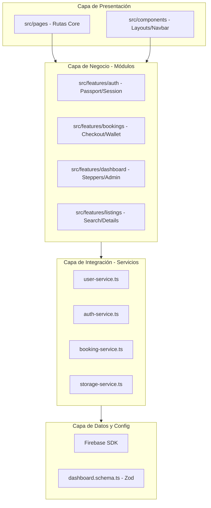

# 📒 Reporte Técnico: Análisis y Estructura del Proyecto VeneStay

Este documento sirve como **Guía de Auditoría Arquitectónica** para desarrolladores, auditores externos y consultores de seguridad de VeneStay. Proporciona una radiografía completa del ecosistema técnico, los flujos de datos y la organización de archivos bajo el lanzamiento de la **Beta de Lechería (Julio 2026)**.

---

## 🚦 1. Ficha del Proyecto y Stack Tecnológico

| Componente | Ecosistema Tecnológico | Versión / Tipo |
| :--- | :--- | :--- |
| **Núcleo de UI** | React | v19.x (Soporte nativo para hooks avanzados) |
| **Compilador / Tipado** | TypeScript | v5.x (Tipado fuerte y sin escapes `any`) |
| **Entorno de Compilación** | Vite | v6.x (Bundler rápido con Hot Module Replacement) |
| **Base de Datos / Auth** | Google Firebase | Cloud Firestore & Firebase Auth (SDK v10) |
| **Almacenamiento CDN** | Firebase Storage | Custodia e indexación de archivos multimedia y documentos |
| **Diseño / Estilos** | Vanilla CSS + Tailwind CSS | Estética Premium Dark (#0B1120) / Dorado Gold (#C5A059) |
| **Iconografía** | Lucide React | Biblioteca vectorial y ligera |

---

## 🗺️ 2. Arquitectura de Módulos (Feature-Based Architecture)

VeneStay implementa una versión ágil de **Feature-Sliced Design (FSD-lite)**. El código fuente dentro de [`src/`](file:///C:/VeneStay/src) está estrictamente segregado para evitar dependencias circulares y garantizar que el escalado del negocio no incremente la complejidad ciclomática del código.

### Detalle de las Capas:

#### A. Capa de Rutas ([`src/pages/`](file:///C:/VeneStay/src/pages))
Orquestadores de vistas de página. No contienen lógica de manipulación de datos pesada ni consumen SDKs directamente; actúan como enlazadores y controladores de enrutamiento dinámico (lazy loads mediante `Suspense`).

#### B. Capa de Módulos Funcionales ([`src/features/`](file:///C:/VeneStay/src/features))
Representa el corazón del marketplace. Cada carpeta encapsula la interfaz de usuario, la validación y el estado local de una característica de negocio:
*   **[`auth/`](file:///C:/VeneStay/src/features/auth):** Control de sesión y el **Pasaporte VeneStay**.
    *   *Ubicación Clave:* [`auth/components/passport/`](file:///C:/VeneStay/src/features/auth/components/passport). Define la visualización del *Trust Score* y el ADN del viajero.
    *   *Lógica:* [`auth/hooks/usePassportForm.ts`](file:///C:/VeneStay/src/features/auth/hooks/usePassportForm.ts) realiza la hidratación de base de datos y la sincronización a `localStorage` de forma reactiva.
*   **[`bookings/`](file:///C:/VeneStay/src/features/bookings):** Lógica financiera de checkout.
    *   *Ubicación Clave:* [CheckoutPage.tsx](file:///C:/VeneStay/src/features/bookings/components/checkout/CheckoutPage.tsx). Integra el cálculo del tipo de cambio, comisiones UCP y la visualización de Soft-Blocking de fechas en el calendario.
*   **[`dashboard/`](file:///C:/VeneStay/src/features/dashboard):** Panel del anfitrión.
    *   *Ubicación Clave:* [ListingForm.tsx](file:///C:/VeneStay/src/features/dashboard/components/ListingForm.tsx). Coordina el formulario modularizado de publicación de propiedades en pasos asíncronos (`StepGeneral`, `StepGallery`, `StepMap`, `StepPayments`).
*   **[`listings/`](file:///C:/VeneStay/src/features/listings):** Exploración y detalle de propiedades.
    *   *Ubicación Clave:* [ListingDetail.tsx](file:///C:/VeneStay/src/features/listings/components/ListingDetail.tsx). Contiene la galería, el panel sticky de reserva y los detalles de contacto seguros del anfitrión.

#### C. Capa de Servicios Puros ([`src/services/`](file:///C:/VeneStay/src/services))
Aísla por completo las librerías de infraestructura del código visual. Si se decidiera cambiar Firebase por otra base de datos en el futuro, **solo se modificaría esta carpeta**.
*   [user-service.ts](file:///C:/VeneStay/src/services/user-service.ts): Abstracciones CRUD de Firestore y cálculo matemático del Trust Score del usuario.
*   [storage-service.ts](file:///C:/VeneStay/src/services/storage-service.ts): Servicio de subida y procesamiento (redimensionado y compresión local) de archivos multimedia.
*   [booking-service.ts](file:///C:/VeneStay/src/services/booking-service.ts): Transacciones financieras complejas y gestión de bloqueos de fechas.

---

## 🔒 3. Seguridad de Datos e Integridad Transaccional

VeneStay implementa tres capas de blindaje para asegurar que los datos del negocio y del usuario no sean vulnerados:

### A. Reglas de Seguridad de Base de Datos ([`firestore.rules`](file:///C:/VeneStay/firestore.rules))
El archivo de reglas aplica control de acceso basado en identidad a nivel de servidor:
*   **Perfiles de Usuario:** Solo el propietario de la cuenta (`request.auth.uid == userId`) tiene permisos de escritura y actualización sobre su perfil privado. Las lecturas del perfil público están permitidas a usuarios autenticados para transparentar las transacciones del marketplace.
*   **Gestión de Propiedades (Listings):** Solo el propietario (`resource.data.hostId == request.auth.uid`) puede actualizar o eliminar su listado.
*   **Transacciones UCP (Unique Payment Payload):** Estructura validada que exige que ningún usuario pueda modificar el estado de un pago si este ya ha sido conciliado en el sistema financiero central.

### B. Reglas de Carga de Archivos ([`storage.rules`](file:///C:/VeneStay/storage.rules))
Control estricto de carga documental (KYC) y fotos:
*   Las fotos de perfil y galería de propiedades deben pesar menos de **5MB** y cumplir con el header de tipo `image/*`.
*   Los documentos de verificación de identidad (Cédulas/Pasaportes) se suben de forma privada al directorio `/kyc/{uid}/` y solo son accesibles por el usuario y los roles administrativos acreditados de VeneStay.

### C. Esquemas Zod y Coerción de Tipos
Toda entrada del usuario es forzada a través de esquemas de validación de Zod en [`dashboard.schema.ts`](file:///C:/VeneStay/src/features/dashboard/types/dashboard.schema.ts):
*   Impide ataques por inyección o tipos incorrectos convirtiendo strings a números válidos (`z.coerce.number()`).
*   Asegura que los campos opcionales no inyecten valores nulos que puedan crashear la interfaz del usuario.

---

## 🎨 4. Directrices de UI & UX (Premium Gold/Dark System)

El auditor visual debe notar que la interfaz de VeneStay está optimizada bajo una paleta de color sofisticada y micro-interacciones interactivas:
*   **Color Base:** `#0B1120` (Navy Oscuro).
*   **Color de Acento:** `#C5A059` (Dorado Gold).
*   **Variables CSS:** Centralizadas en [`index.css`](file:///C:/VeneStay/src/index.css), evitando que los desarrolladores usen colores "ad-hoc" que arruinen la coherencia de marca.
*   **Animaciones:** Empleo selectivo de transiciones HSL y Framer Motion con soporte de accesibilidad respetando la preferencia del usuario (`prefers-reduced-motion`).

---

## 🎯 5. Compilación y Control de Calidad (Quality Gates)

Para pasar a producción, el proyecto debe cruzar exitosamente tres compuertas de calidad:
1.  **Gate de Compilación (TypeScript):** El comando `tsc --noEmit` debe dar código de salida `0` (Cero errores de tipado).
2.  **Gate de Calidad (ESLint):** `eslint .` debe certificar cero errores severos en el mapeo de dependencias de hooks o componentes huérfanos.
3.  **Gate de Accesibilidad (WCAG 2.2 AA):** Todo elemento interactivo debe poder controlarse con navegación por teclado y poseer descriptores semánticos (`aria-label`, `aria-describedby`, etc.) para lectores de pantalla.

---

## 🔐 6. Credenciales y Entorno de Desarrollo Autorizado

*   **Usuario de Auditoría / QA Maestro:** `anfitrionvenestay@venestay.com` (Usa el rol unificado para flujos de Huésped, Anfitrión y Administrador).
*   **Puerto de Desarrollo Local:** `http://localhost:3000/` (Configurado en [vite.config.ts](file:///C:/VeneStay/vite.config.ts)).
*   **Host de Servidor:** Escucha en `0.0.0.0` para permitir pruebas en dispositivos móviles en la misma red de red local.

---
**Elaborado por la División de Ingeniería de IA de Antigravity**  
*Última Actualización: 18 de Mayo de 2026*  
*Versión de Documentación: v2.3.0*
