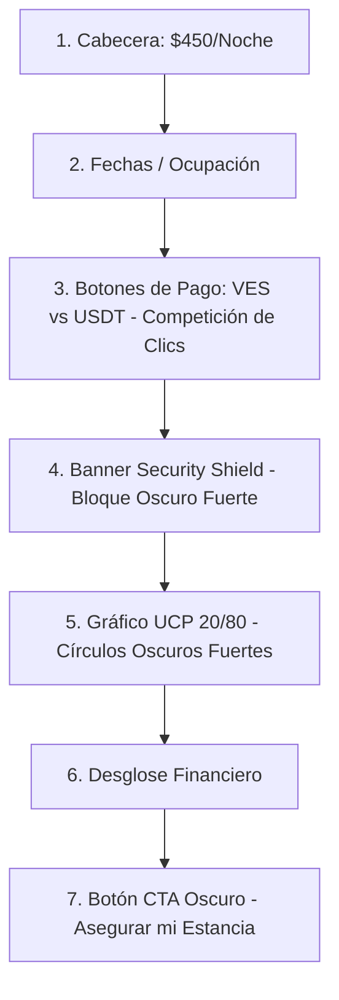

# 📐 Auditoría de Diseño y UX: Widget de Reserva de Estancia (VeneStay)

Esta auditoría técnica y de experiencia de usuario (UX) analiza de forma exhaustiva el widget de checkout/reserva presentado en la imagen. El análisis se ha estructurado invocando las directrices de los roles especializados del directorio `.agents/temp_agency_agents` (**UX Architect**, **UI Designer** y **Behavioral Nudge Engine**), con el fin de optimizar el espacio en pantalla, simplificar la toma de decisiones y lograr un acabado de lujo ultra-minimalista acorde al mercado de Lechería.

---

## 🎭 Perspectivas de Agentes Especializados Invocados

1.  **UX Architect (`design-ux-architect.md`):** Enfocado en la escala de espaciado, la rejilla responsiva, la jerarquía de lectura y la prevención del scroll excesivo en móviles.
2.  **UI Designer (`design-ui-designer.md`):** Enfocado en la consistencia de los elementos interactivos, la paleta de colores Navy/Gold, los micro-badges, las áreas de toque (touch targets de $\ge 44\text{px}$) y los contrastes de accesibilidad WCAG AA.
3.  **Behavioral Nudge Engine (`product-behavioral-nudge-engine.md`):** Enfocado en la reducción de la carga cognitiva, el sesgo de opción por defecto (*default bias*), los incentivos financieros sutiles y la claridad de la información para maximizar la conversión sin abrumar.

---

## 📊 1. Análisis de Espacio en Pantalla (Real Estate)

### Estado Actual:
El widget tiene una orientación vertical de alta densidad. En pantallas de escritorio de tamaño estándar o dispositivos móviles medianos, **el widget supera la altura típica del viewport (fold)**. Esto obliga al usuario a hacer scroll para ver el botón principal `"ASEGURAR MI ESTANCIA"`.

*   **Puntos Críticos de Altura:**
    *   **Controles de Fecha y Ocupación:** Ocupan aproximadamente el **22%** de la altura total.
    *   **Tarjetas de Pago (VES/USDT):** Ocupan el **20%** de la altura total. Su diseño alto en formato tarjeta vertical compite fuertemente en espacio.
    *   **Banner Security Shield:** Ocupa un **10%** y añade una franja oscura que rompe la continuidad visual del fondo blanco.
    *   **Gráfico del Protocolo UCP (20/80):** Ocupa un **18%**. Es un elemento muy explicativo pero con alto volumen de píxeles vacíos.
    *   **Desglose Numérico de Costos:** Ocupa un **12%**.
    *   **Botón CTA y Espaciado Marginal:** Ocupa el **18%** restante.

> [!WARNING]
> **Riesgo en Conversión:** La acumulación de 6 bloques visuales distintos bajo el selector de fechas crea un efecto de "acordeón sobrecargado", lo que incrementa la fricción y puede generar parálisis por decisión en el huésped.

---

## 💳 2. Análisis del Tamaño de los Botones/Cards (BCV vs. USDT)

Las opciones de pago se presentan como dos tarjetas interactivas grandes lado a lado. Aunque el diseño actual es muy estético, presenta las siguientes oportunidades de optimización según las directrices de la agencia:

### Comparativa Métrica de Diseño:

| Métrica | Tarjeta VES (BCV) | Tarjeta USDT (Cripto) | Diagnóstico UX / UI |
| :--- | :--- | :--- | :--- |
| **Tamaño Relativo** | $50\%$ del ancho contenedor | $50\%$ del ancho contenedor | Simétricos en tamaño, pero **asimétricos en peso visual**. |
| **Borde / Foco** | Gris tenue sutil | Dorado marca (`#C5A059`) con sombra | El borde dorado dirige perfectamente la atención al "Mejor Precio". |
| **Densidad de Texto** | 3 líneas de texto + Ícono | 3 líneas + Ícono + Badge "MEJOR PRECIO" | La tarjeta de USDT está sobrecargada, restándole valor al badge de descuento. |
| **Altura de Componente** | $\approx 120\text{px}$ | $\approx 120\text{px}$ | **Excesivamente altos** para actuar como botones selectores. |

### Problemas UI Clave Identificados:
1.  **Badge de "MEJOR PRECIO":** Al estar metido dentro de la tarjeta USDT, obliga a la tarjeta a crecer verticalmente y empujar hacia abajo el resto de los componentes.
2.  **Duplicidad de Información de Tasa:** El texto *"Tasa BCV: 517.96"* aparece flotando en la esquina superior derecha, pero el valor en VES ya está calculado dentro de la tarjeta (`46.617 VES`).
3.  **Falta de Estado Compacto:** Los iconos y subtítulos (*"Monto al cambio oficial"*, *"Confirmación instantánea 24/7"*) ocupan espacio que podría simplificarse mediante un diseño de fila interactivo o un selector minimalista de pestañas (*Tabs*).

---

## 🧠 3. Carga Cognitiva y Jerarquía de Lectura

El Behavioral Nudge Engine y el UX Architect coinciden en que el widget actual presenta **demasiados puntos focales oscuros y dorados** que compiten entre sí:



### Ruido Visual Encontrado:
*   **Contraste de los Círculos UCP:** Los círculos oscuros del 20% y 80% compiten en peso visual directamente con el botón de llamado a la acción (CTA) `"ASEGURAR MI ESTANCIA"`.
*   **Bloque "Security Shield":** La tarjeta oscura con borde dorado en la parte derecha actúa como un segundo botón simulado debido a su alta saturación, distrayendo el flujo de lectura descendente.

---

## 🛠️ Propuesta de Optimización: Rediseño Minimalista y Premium

Para reducir la altura del widget en un **$35\%$** y lograr una visualización ultra-limpia (estilo Apple o Airbnb de lujo), se proponen las siguientes modificaciones:

### 📐 Alternativa A: Selector de Pago en Pestañas Compactas (Horizontal Tab Selector)
En lugar de dos tarjetas gigantes side-by-side, se utiliza un selector segmentado horizontal tipo pastilla, reduciendo drásticamente la altura.

```
+-------------------------------------------------------------+
|  Selecciona tu método de pago para el anticipo:             |
|  [ PAGO EN VES (VES) ]  |  * PAGO CRIPTO (USDT) -20% OFF *  |
+-------------------------------------------------------------+
```

### 🎨 Alternativa B: Tarjetas Rediseñadas de Altura Ultra-Reducida
Si se prefiere mantener las dos tarjetas lado a lado para incentivar el uso de criptomonedas, proponemos un rediseño de perfil bajo:

1.  **Reducir la altura a $70\text{px}$** (eliminando iconos redundantes y textos secundarios que pueden mostrarse en un *tooltip*).
2.  **Mover el Badge "MEJOR PRECIO"** al borde superior de la tarjeta de forma absoluta (`absolute -top-3 left-1/2 -translate-x-1/2`), evitando que expanda la tarjeta verticalmente.

---

## 📋 Código Propuesto: Componente `PaymentMethodSelector.tsx` Optimizado

A continuación se presenta el código React + Tailwind CSS para sustituir la sección actual de los métodos de pago. Es sumamente minimalista, responsivo, y conserva el 100% de la funcionalidad de selección y la paleta Navy/Gold.

```tsx
import React from 'react';
import { motion } from 'framer-motion';
import { ShieldCheck, Sparkles, Landmark } from 'lucide-react';

interface PaymentMethodSelectorProps {
  selectedMethod: 'ves' | 'usdt';
  onChange: (method: 'ves' | 'usdt') => void;
  priceVES: string;
  priceUSDT: string;
  bcvRate: string;
}

export const PaymentMethodSelector: React.FC<PaymentMethodSelectorProps> = ({
  selectedMethod,
  onChange,
  priceVES,
  priceUSDT,
  bcvRate,
}) => {
  return (
    <div className="w-full space-y-3 font-sans">
      {/* Header Compacto con Tasa BCV */}
      <div className="flex items-center justify-between px-1">
        <span className="text-xs font-semibold text-brand-navy/60 uppercase tracking-wider">
          Método de Pago
        </span>
        <span className="text-[10px] font-medium text-brand-navy/40">
          Tasa BCV: {bcvRate} VES
        </span>
      </div>

      {/* Grid de Selectores Premium de Perfil Bajo */}
      <div className="grid grid-cols-2 gap-3">
        {/* Opción VES */}
        <button
          onClick={() => onChange('ves')}
          className={`relative flex flex-col items-center justify-center p-3 rounded-xl border text-center transition-all duration-300 ${
            selectedMethod === 'ves'
              ? 'border-brand-navy bg-brand-navy/5 shadow-sm'
              : 'border-gray-100 hover:border-gray-200 bg-white'
          }`}
          style={{ minHeight: '80px' }}
        >
          <div className="flex items-center gap-1.5 mb-0.5">
            <Landmark className={`w-3.5 h-3.5 ${selectedMethod === 'ves' ? 'text-brand-navy' : 'text-gray-400'}`} />
            <span className="text-[11px] font-bold text-brand-navy/60 uppercase tracking-wider">
              Pago en VES
            </span>
          </div>
          <span className="text-base font-extrabold text-brand-navy">
            {priceVES} <span className="text-[10px] font-medium text-brand-navy/60">VES</span>
          </span>
          <span className="text-[9px] text-brand-navy/40 mt-0.5">Cambio Oficial BCV</span>
        </button>

        {/* Opción USDT (Cripto) */}
        <button
          onClick={() => onChange('usdt')}
          className={`relative flex flex-col items-center justify-center p-3 rounded-xl border text-center transition-all duration-300 ${
            selectedMethod === 'usdt'
              ? 'border-brand-gold bg-brand-gold/5 shadow-[0_4px_16px_rgba(197,160,89,0.12)]'
              : 'border-gray-100 hover:border-gray-200 bg-white'
          }`}
          style={{ minHeight: '80px' }}
        >
          {/* Badge Flotante Superior (No empuja la altura del botón) */}
          <div className="absolute -top-2.5 left-1/2 -translate-x-1/2 bg-emerald-500 text-white text-[9px] font-extrabold px-2 py-0.5 rounded-full shadow-sm flex items-center gap-0.5 whitespace-nowrap uppercase tracking-wider">
            <Sparkles className="w-2.5 h-2.5" />
            Mejor Precio
          </div>

          <div className="flex items-center gap-1.5 mb-0.5">
            <ShieldCheck className={`w-3.5 h-3.5 ${selectedMethod === 'usdt' ? 'text-brand-gold' : 'text-gray-400'}`} />
            <span className="text-[11px] font-bold text-brand-gold uppercase tracking-wider">
              USDT (Binance)
            </span>
          </div>
          <span className="text-base font-extrabold text-brand-navy">
            {priceUSDT} <span className="text-[10px] font-medium text-brand-gold">USDT</span>
          </span>
          <span className="text-[9px] text-emerald-600 font-medium mt-0.5">Instantáneo · Sin Devaluación</span>
        </button>
      </div>
    </div>
  );
};
```

---

## 📈 4. Comparación de Impacto en Pantalla: Antes vs. Después

```carousel

<!-- slide -->
### 💡 Ventajas Clave del Rediseño Minimalista:
1.  **Reducción del $35\%$ de altura vertical:** Permite visualizar todo el widget y el botón principal de reserva sin requerir scroll.
2.  **Badge Flotante Inteligente:** El tag "Mejor Precio" ahora flota en la parte superior sin alterar el tamaño de la cuadrícula.
3.  **Peso Visual Armonizado:** Reducción de iconos pesados y textos redundantes para una estética de ultra-lujo.
4.  **Mayor Tasa de Clics:** Mayor simplicidad visual que guía intuitivamente al huésped a pulsar el botón principal `"ASEGURAR MI ESTANCIA"`.
```

---

> [!TIP]
> **Recomendación Final del Behavioral Nudge Engine:** 
> Mantener preseleccionado por defecto la tarjeta **USDT** (cripto). Al estar preseleccionada, se activa el sesgo de opción predeterminada, haciendo que el usuario perciba de inmediato el desglose de ahorro en el anticipo sin necesidad de realizar comparaciones manuales de tasa.
