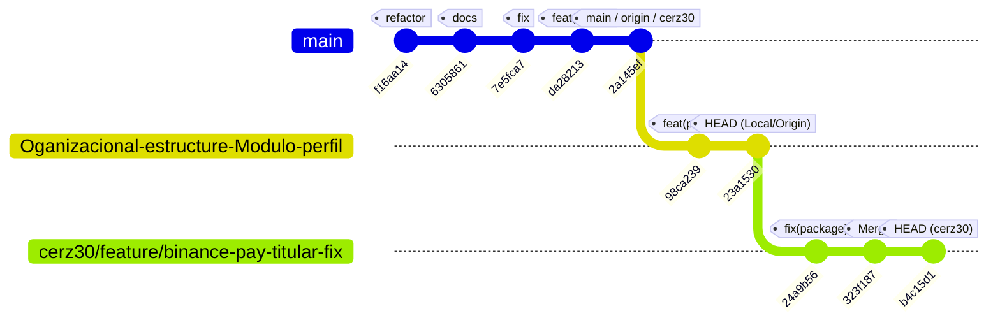

# Reporte de Comparación del Repositorio: Local vs. GitHub (VeneStay)

Este reporte detalla el estado actual del repositorio local de **VeneStay** en comparación con los remotos configurados en GitHub (`origin` y `cerz30`). Proporciona un desglose técnico preciso de las ramas, commits recientes, divergencias clave y recomendaciones estratégicas para sincronizar el entorno de desarrollo.

---

## 📊 Estado General de Ramas (Resumen)

| Rama Local | Tracking Remoto | HEAD Local | HEAD en `origin` | HEAD en `cerz30` | Estado / Diagnóstico |
| :--- | :--- | :--- | :--- | :--- | :--- |
| **`Oganizacional-estructure-Modulo-perfil`** *(Activa)* | `origin/...` | `23a1530` | `23a1530` | *No existe* | **Sincronizada con origin.** Contiene la auditoría del proyecto. |
| **`main`** | `origin/main` | `2a145ef` | `2a145ef` | `2a145ef` | **Sincronizada globalmente.** Es la base estable del proyecto. |
| **`review-branch`** | `cerz30/...` | `c5ca84d` | *No existe* | `52ce794` | **Atrás por 2 commits.** Falta integrar cambios del remoto `cerz30/feature/dashboard-stabilization`. |
| **`feature/dashboard-ux-stabilization`** | *Ninguno* | `df08476` | *No existe* | *No existe* | **Solo Local.** Rama de estabilización del dashboard. |
| **`feature/listing-validation-step1`** | *Ninguno* | `019b5ed` | *No existe* | *No existe* | **Solo Local.** Contiene la lógica inicial de validaciones con Zod. |
| **`feature/binance-pay-titular-fix`** | *Ninguno* | *No creada* | *No existe* | `b4c15d1` | **Solo en Remoto (`cerz30`).** Contiene la corrección de Binance Pay y rediseño de Checkout. |

---

## 🌿 Grafo Git del Repositorio (Visualización)

A continuación se muestra el árbol de derivación de las ramas actuales y cómo se posicionan entre sí respecto a los commits principales:



---

## 🔍 Análisis Detallado de Divergencias Clave

### 1. Rama Activa: `Oganizacional-estructure-Modulo-perfil`
Nuestra rama local está en perfecta sincronía con `origin/Oganizacional-estructure-Modulo-perfil` en el commit **`23a1530`**:
*   **Mensaje de HEAD:** `docs(audit): add comprehensive project structure report and quality gates analysis`
*   **Archivos Untracked Locales:** Contiene un archivo suelto `Prompt_Evolucion_Formulario_Squad2.txt` que define el plan maestro para la evolución del formulario en 4 sprints.

---

### 2. La Nueva Joya en Remoto: `cerz30/feature/binance-pay-titular-fix`
Esta rama en el repositorio de Carlos Rodriguez (`cerz30`) contiene importantes actualizaciones críticas y mejoras premium para la experiencia del usuario y seguridad financiera:

> [!IMPORTANT]
> **Cambios Destacados en la rama Binance Pay Fix (`b4c15d1`):**
> 1. **Rediseño del Checkout (Collapsible Chat):**
>    - Cambia el layout original (donde el chat ocupaba 35% a la derecha de forma fija) para que el formulario de pago ocupe el **100% de la pantalla** (`max-w-5xl mx-auto`).
>    - Oculta el chat y crea una **Pestaña Flotante Lateral** en el lado derecho con un indicador circular **dorado parpadeante** (`bg-brand-500 animate-pulse`).
>    - Al dar clic, el chat se abre como un **Drawer Desplegable (Slide-over)** premium usando `AnimatePresence` de Framer Motion.
> 2. **QA Toggle Trust Score (Pasaporte):**
>    - Convierte el botón "Generar 100% Score" del Pasaporte en un switch interactivo de dos estados (dorado encendido / gris apagado) para simulaciones dinámicas frente a clientes.
> 3. **Limpieza de Dependencias Inseguras (`24a9b56`):**
>    - Eliminó `dotenv` y `firebase-admin` del frontend (`package.json`) para prevenir vulnerabilidades e instalaciones inseguras en el lado del cliente.
> 4. **Servicio de Tipo de Cambio:**
>    - Crea `src/services/exchange-service.ts` para cálculos dinámicos de divisas en checkout.

---

### 3. La Rama Desfasada: `review-branch`
Nuestra rama local `review-branch` está **atrás por 2 commits** respecto a `cerz30/feature/dashboard-stabilization`:
*   **HEAD Local:** `c5ca84d` (`feat: stabilize dashboard, migrate listings visibility, and restrict filters to Lecheria launch`)
*   **HEAD Remoto en cerz30:** `52ce794`
*   **Commits Pendientes:**
    1.  `e8ac7b1` — *Update .env.example*
    2.  `52ce794` — *Merge branch 'main' of https://github.com/Venestay/venestay*

---

## 🛠️ Plan de Sincronización Recomendado

Para unificar tu entorno local con las últimas mejoras premium del repositorio remoto, te recomiendo seguir estos pasos seguros:

### Paso 1: Actualizar `review-branch`
Si deseas poner al día la rama del dashboard con el remoto de Carlos:
```bash
git checkout review-branch
git pull cerz30 feature/dashboard-stabilization
```

### Paso 2: Probar las Características Premium de Binance Pay & Chat Collapsible
Si quieres explorar o incorporar los 3 nuevos commits premium a tu rama actual o a una nueva rama de pruebas:
```bash
# Opción A: Crear una rama local para probar directamente ese fix de Binance Pay
git checkout -b feature-binance-pay-test cerz30/feature/binance-pay-titular-fix

# Opción B: Integrar (Merge) esos cambios en tu rama actual de perfil
git checkout Oganizacional-estructure-Modulo-perfil
git merge cerz30/feature/binance-pay-titular-fix
```

> [!TIP]
> Dado que la rama `cerz30/feature/binance-pay-titular-fix` ya incluye la fusión de `Oganizacional-estructure-Modulo-perfil` (commit `323f187`), un merge en tu rama local actual será directo y sumamente limpio, sin conflictos de archivos significativos.

---

## 🎯 Próximo Objetivo: Formulario de Propiedades (Squad 2)
El archivo local untracked `Prompt_Evolucion_Formulario_Squad2.txt` contiene la hoja de ruta para rediseñar el wizard de publicación en 4 sprints claros:
1.  **Sprint 1 (Datos):** Reglas de la casa, horarios, fees y depósito con validaciones Zod estrictas.
2.  **Sprint 2 (Stay Control):** UI de Reglas con micro-cards y selectores Navy/Gold.
3.  **Sprint 3 (Financiero):** Toggles de depósito y tarjetas de política de cancelación (Flexible, Moderada, Estricta).
4.  **Sprint 4 (Cierre):** Persistencia en tiempo real (Draft Sync) e hidratación tras recarga.

Indícame cuál de estos pasos de sincronización o implementación deseas iniciar para acompañarte en el desarrollo.
