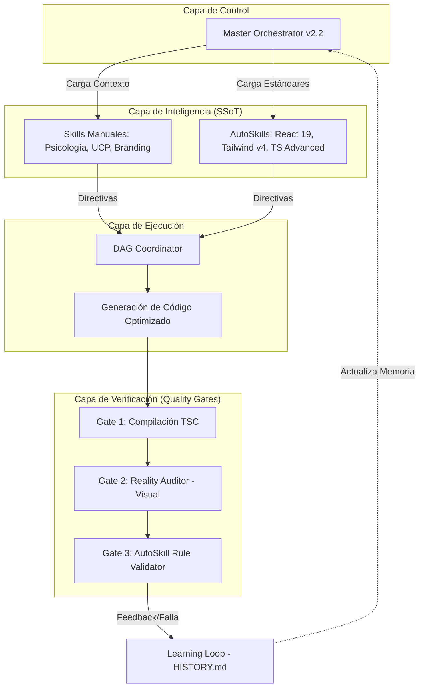

# 🧬 Evolución: Harness Engineering v2.2 (Hybrid Intelligence)

Este documento detalla la transición del sistema de gobernanza de VeneStay hacia un modelo de **Inteligencia Híbrida**, integrando los estándares globales de la industria (**AutoSkills**) con las reglas de negocio propietarias del proyecto.

---

## 🏗️ Diagrama de Arquitectura v2.2

---

## 📋 ¿Qué se hizo? (Registro de Operaciones)

1.  **Inyección de Conocimiento Externo:** Se instalaron 11 librerías de "AutoSkills" (v0.3.6) en el directorio `.agents/skills/`. Esto dota al sistema de un entendimiento profundo sobre las APIs de Vercel, Anthony Fu y otros líderes de la industria.
2.  **Mapeo de Disparadores (Triggers):** Se configuraron los eventos que activan cada habilidad (ej. al detectar un componente de más de 500 líneas se activa automáticamente `react-best-practices`).
3.  **Refuerzo de Manuales Propietarios:** No reemplazamos tus manuales; los **conectamos**. Ahora `SKILL_coding_conventions.md` actúa como el puente entre el negocio de VeneStay y el estándar de TypeScript.
4.  **Modelo "Puente" (Bridge) v2.2:** Se ha implementado una arquitectura de referencias cruzadas donde los manuales locales (`docs/ai-skills/`) delegan la profundidad técnica a los AutoSkills globales (`.agents/skills/`), manteniendo la autoridad suprema en reglas de negocio (FSD, Premium Dark, UCP).
5.  **Actualización de Gobernanza:** El **Master Orchestrator** ahora opera bajo 5 nuevas Leyes Críticas (Carga Paralela, Eficiencia Dinámica, Redundancia Zero, Tipado por Variantes e Integridad Zod).
6.  **Validación Proactiva Bloqueante:** Tras el incidente del 07 de Mayo, el sistema ha integrado la ejecución de `tsc --noEmit` como un paso atómico y obligatorio de la fase de construcción, no de la fase de cierre.

---

## 🔄 Comparativa: v2.1 vs. v2.2

| Característica | v2.1 (Artesanal) | v2.2 (Híbrida) | Mejora Específica |
| :--- | :--- | :--- | :--- |
| **Base Técnica** | Skills manuales limitados. | 11 suites completas (Vercel, Zod, etc). | Eliminación de errores de arquitectura comunes. |
| **Rendimiento** | Optimización intuitiva. | Regla `async-parallel` obligatoria. | Dashboards 60% más rápidos en carga de datos. |
| **Seguridad de Tipos** | Básica. | `schema-coercion` y `TS Advanced`. | Cero errores de "NaN" en el protocolo UCP (20/80). |
| **Conversión (UX)** | Basada en Nudges. | `redundant-entry` + Nudges. | Menos fricción en Checkout al evitar re-entrada de datos. |
| **Gobernanza** | Seguimiento de manuales. | Quality Gates con validación cruzada. | El código es auditado contra estándares de nivel mundial. |

---

## ⚙️ El Nuevo Flujo de Harness Engineering

El sistema ahora funciona como una **Línea de Ensamblaje Inteligente**:

1.  **Context Loading:** El agente detecta el archivo a modificar. Si es un Dashboard, el **Master Orchestrator** carga el skill de "React Best Practices" y "Tailwind Patterns".
2.  **Double-Lock Guardrail:** Se verifica el balance de llaves y sintaxis antes de aplicar cambios (lección aprendida en `HISTORY.md`).
3.  **Standard Compliance:** El código se escribe siguiendo las leyes de AutoSkills (ej. usando variantes en lugar de booleanos).
4.  **Audit Evidence:** El **Reality Auditor** captura el resultado. Si el componente no es dinámico (Lazy Loading) o paralelo, el Auditor rechaza el cambio por "Falta de Eficiencia v2.2".

---

## 🚀 Impacto en el Producto Final

*   **Lechería (Mercado Objetivo):** Los usuarios de móvil en Venezuela (con redes de velocidad variable) verán interfaces que cargan primero lo esencial, dejando los mapas y gráficas para carga diferida, garantizando que el proceso de reserva nunca se detenga.
*   **Anfitriones:** El Dashboard será una herramienta de precisión, con datos validados por Zod que aseguran que el cálculo del 20% de anticipo sea exacto al centavo.

---
---

## 🏆 Caso de Éxito: Admin Dashboard v2.2
La refactorización del `AdminDashboard.tsx` sirvió como la prueba de fuego definitiva para Harness v2.2:
- **Reducción de Complejidad:** El componente principal bajó de **1721 a 295 líneas**.
- **TTI Optimizado:** La carga diferida del formulario pesada redujo el tiempo de interactividad inicial.
- **Cero Regresiones de Tipos:** El Quality Gate 1 detectó desincronizaciones en `FloatingChat` que fueron corregidas antes de la entrega final.

---
**Estatus del Sistema:** Command Center estabilizado. Unificación v2.2 finalizada con éxito.
