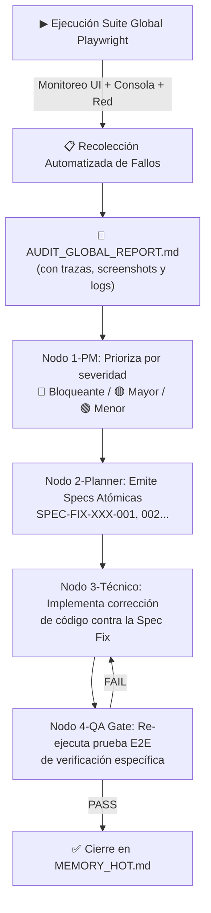

# Estrategia de Auditoría Global E2E con Playwright — VeneStay

> **Documento Maestro de Auditoría Automatizada**
> **Versión:** 2.0 — Revisión Arquitectural (27 Jun 2026)
> **Estado:** PLANIFICADO → Pendiente de ejecución por Nodo 2-Planner
> **Objetivo:** Detectar incidencias funcionales en todos los módulos del proyecto mediante pruebas E2E automatizadas, para alimentar el pipeline SDD con *Specs de Corrección* (`Spec Fix`) de forma estructurada y predecible.

---

## 1. Topografía Real del Proyecto (Base de la Auditoría)

Antes de planificar ninguna prueba, se catalogaron las **rutas reales** registradas en [`App.tsx`](file:///c:/Proyecto%20Venestay/VeneStay/src/App.tsx), los componentes de cada feature y sus hooks críticos. Este inventario es la fuente de verdad de la auditoría.

### Rutas de la aplicación (React Router)

| Ruta | Componente | Protección |
| :--- | :--- | :--- |
| `/` | `Home.tsx` | Pública |
| `/host-guide` | `HostGuide.tsx` | Pública |
| `/listing/:id` | `ListingDetail.tsx` | Pública |
| `/checkout` | `CheckoutPage.tsx` | Pública (sesión requerida en acción) |
| `/checkout/:bookingId` | `CheckoutPage.tsx` | Pública (sesión requerida en acción) |
| `/mis-viajes` | `MyTrips.tsx` | **ProtectedRoute** (requiere sesión) |
| `/mi-pasaporte` | `ProfileSettings.tsx` | **ProtectedRoute** (requiere sesión) |
| `/publicar-espacio` | `AdminDashboard.tsx` | **ProtectedRoute** (requiere sesión) |
| `/admin/nueva-propiedad` | `AdminDashboard.tsx` | **ProtectedRoute** (requiere sesión) |
| `/admin/mis-propiedades` | `AdminDashboard.tsx` | **ProtectedRoute** (requiere sesión) |
| `/dashboard` | `AdminDashboard.tsx` | **ProtectedRoute** (requiere sesión) |
| `/auth/action` | `AuthAction.tsx` | Pública (handler Firebase) |

### Componentes críticos y superficie de riesgo

| Feature | Archivos de Mayor Riesgo | Superficie de Fallo |
| :--- | :--- | :--- |
| `auth/` | `AuthModal.tsx`, `ProfileSettings.tsx`, `KYCRequiredModal.tsx` | Estado congelado, pérdida de sesión, loop KYC |
| `bookings/` | `MyTrips.tsx`, `useCheckout.ts`, `useChatNotifications.tsx` | Chat sin tiempo real, temporizador de pago, badge de notificaciones |
| `bookings/checkout/` | `CheckoutPage.tsx`, `ExchangeCalculator.tsx`, `PaymentSettings.tsx` | Cálculo de tasas USD/VES, subida de comprobantes, estados de error |
| `listings/` | `ListingDetail.tsx`, `BookingPanel.tsx`, `DirectRequestForm.tsx` | Galería, bloqueo de reserva, envío de solicitud |
| `dashboard/` | `AdminDashboard.tsx`, `KYCAuditPanel.tsx`, `GuestRequestVerificationDrawer.tsx` | Acceso por rol, aprobación KYC, gestión de propiedades |

---

## 2. Capacidades de Playwright Empleadas en esta Auditoría

### A. Pruebas Funcionales E2E (Simulación de Usuario Real)
- Navegación multi-ruta según el mapa de `App.tsx`.
- Formularios complejos: wizard de 4 pasos (`StepGeneral`, `StepMap`, `StepGallery`, `StepPayments`) y `DirectRequestForm`.
- Subida de archivos reales: comprobantes de pago (Zelle / Pago Móvil) y documentos de identidad KYC.
- Interacción con el calendario de disponibilidad (`Calendar.tsx`).

### B. Auditoría Silenciosa de Consola y Red
```typescript
// Patrón obligatorio en todas las suites: captura de errores JS invisibles
page.on('pageerror', (err) => {
  consoleErrors.push(`PAGEERROR: ${err.message}`);
});
page.on('console', (msg) => {
  if (msg.type() === 'error') consoleErrors.push(`CONSOLE: ${msg.text()}`);
});
page.on('response', (res) => {
  if (res.status() >= 400) networkErrors.push(`${res.status()} ${res.url()}`);
});
```
Esto detecta: excepciones no controladas en React, errores `403 Forbidden` en reglas de Firestore, y llamadas fallidas a Cloud Functions.

### C. Preservación de Sesiones por Rol (`storageState`)
```typescript
// Setup: Guardar autenticación en archivo reutilizable
await page.context().storageState({ path: 'tests/.auth/guest.json' });
// En cada suite posterior, reutilizar sin re-login
use: { storageState: 'tests/.auth/guest.json' }
```
Roles definidos para la auditoría:
- **Huésped:** `rodriguezzcarlose@gmail.com` / `Venestay1015`
- **Anfitrión/Admin:** Cuenta con `isAdmin: true` en Firestore (a definir por el equipo).

### D. Pruebas Responsive (Mobile vs Desktop)
- **Desktop:** `1280 × 800` (Chromium, configuración por defecto del proyecto).
- **Mobile:** `375 × 812` (simulación iPhone 13) — validación de `Navbar` hamburguesa, `Drawers` y pestañas táctiles.

---

## 3. Matriz de Suites Maestras (Vinculada al Código Real)

> [!NOTE]
> Cada suite está mapeada al archivo de código fuente correspondiente para que el Nodo 3-Técnico pueda localizar el bug sin ambigüedad.

### Suite 1 — Autenticación & Pasaporte | `auth.spec.ts`

| ID Caso | Flujo a Probar | Archivos Implicados | Error Probable |
| :--- | :--- | :--- | :--- |
| AUTH-01 | Abrir `AuthModal` → pestaña Login → ingresar credenciales → cerrar sesión | `AuthModal.tsx` | Modal no cierra, error de Firebase auth |
| AUTH-02 | Flujo de recuperación de contraseña (email + enlace `/auth/action`) | `AuthModal.tsx`, `AuthAction.tsx` | Enlace expirado, redirección incorrecta |
| AUTH-03 | Registro de nuevo usuario → `UserProfileSetup.tsx` | `AuthModal.tsx`, `UserProfileSetup.tsx` | Formulario no valida Zod correctamente |
| AUTH-04 | Acceso a `/mi-pasaporte` → editar Bio, seleccionar moneda USD → guardar | `ProfileSettings.tsx` | Cambios no persisten en Firestore |
| AUTH-05 | KYC Loop: usuario sin KYC intenta reservar → aparece `KYCRequiredModal` | `KYCRequiredModal.tsx`, `ListingDetail.tsx` | Modal no aparece, bucle de redirección |
| AUTH-06 | Acceso a ruta protegida sin sesión → redirige a `/` | `App.tsx`, `ProtectedRoute` | Redirección no ocurre, datos expuestos |

---

### Suite 2 — Exploración & Búsqueda | `explore.spec.ts`

| ID Caso | Flujo a Probar | Archivos Implicados | Error Probable |
| :--- | :--- | :--- | :--- |
| EXP-01 | Cargar Home → verificar que se muestran listados en la grilla | `Home.tsx`, `ListingCard.tsx` | Pantalla en blanco, error Firestore al cargar |
| EXP-02 | Filtrar por ciudad "Lechería" → resultado filtrado | `Home.tsx`, filtros internos | Filtro no aplica, todos los resultados siguen visibles |
| EXP-03 | Búsqueda por texto en Navbar → resultado coherente | `Navbar.tsx` | Sin resultados aunque existan alojamientos |
| EXP-04 | Filtrar por rango de fechas → verificar exclusión de fechas ocupadas | `Home.tsx`, `Calendar.tsx` | Alojamientos bloqueados siguen apareciendo |
| EXP-05 | Scroll/carga de más alojamientos (si aplica paginación) | `Home.tsx` | Lista infinita no carga o duplica ítems |

---

### Suite 3 — Detalle de Alojamiento & Reserva | `listing-detail.spec.ts`

| ID Caso | Flujo a Probar | Archivos Implicados | Error Probable |
| :--- | :--- | :--- | :--- |
| DET-01 | Navegar a `/listing/:id` → carga de galería de fotos | `ListingDetail.tsx`, `ListingGallery.tsx` | Imágenes rotas (URLs expiradas de Storage) |
| DET-02 | `ExchangeCalculator`: seleccionar noches → verificar total USD y VES | `ExchangeCalculator.tsx` | `TypeError` si `rate` es undefined (tasa no cargada) |
| DET-03 | Abrir `BookingPanel` → seleccionar fechas → verificar precio dinámico | `BookingPanel.tsx`, `Calendar.tsx` | Precio no actualiza al cambiar fechas |
| DET-04 | Enviar `DirectRequestForm` (solicitud de reserva huésped) | `DirectRequestForm.tsx` | Error 403 en Firestore, botón bloqueado sin feedback |
| DET-05 | Mapa de ubicación visible sin errores (`ListingMap.tsx`) | `ListingMap.tsx` | Mapa no carga, error de API key Google Maps |
| DET-06 | Sección de reseñas visible y correctamente paginada | `ListingReviews.tsx` | Reseñas no aparecen o contador erróneo |

---

### Suite 4 — Mis Viajes & Checkout | `bookings.spec.ts`

| ID Caso | Flujo a Probar | Archivos Implicados | Error Probable |
| :--- | :--- | :--- | :--- |
| BOOK-01 | Ir a `/mis-viajes` → pestañas Activos / Pasados / Cancelados | `MyTrips.tsx`, `useTripFilters.ts` | Pestañas no filtran, o estado vacío incorrecto |
| BOOK-02 | Badge de chat rojo en botón Chat si hay mensajes sin leer | `MyTrips.tsx`, `useChatNotifications.tsx` | Badge no aparece o muestra cuenta incorrecta *(ya verificado)* |
| BOOK-03 | Clic en "Ver Resumen" → abre `BookingSummaryModal` con datos correctos | `MyTrips.tsx`, `BookingSummaryModal.tsx` | Modal con datos vacíos o precio incorrecto |
| BOOK-04 | Ir a `/checkout/:bookingId` → verificar temporizador de pago | `CheckoutPage.tsx`, `useCheckout.ts` | Temporizador no inicia, o expira antes de lo esperado |
| BOOK-05 | Subir comprobante de pago (archivo PDF/imagen) | `CheckoutPage.tsx`, `PaymentSettings.tsx` | Upload falla por reglas de Storage, sin feedback de error |
| BOOK-06 | Solicitud de reagendamiento → `RescheduleRequestModal` | `RescheduleRequestModal.tsx`, `useRescheduleRequest.ts` | Modal no abre, fechas propuestas no se guardan |

---

### Suite 5 — Gestión de Anfitrión (Wizard de Propiedad) | `host-listings.spec.ts`

| ID Caso | Flujo a Probar | Archivos Implicados | Error Probable |
| :--- | :--- | :--- | :--- |
| HOST-01 | Acceder a `/publicar-espacio` como anfitrión → `ListingForm` abre | `AdminDashboard.tsx`, `ListingForm.tsx` | Redirige aunque el usuario es anfitrión |
| HOST-02 | Completar `StepGeneral`: título, descripción, categoría, capacidad | `StepGeneral.tsx` | Validaciones Zod no disparan mensajes de error claros |
| HOST-03 | `StepMap`: seleccionar ubicación en mapa → persistir coordenadas | `StepMap.tsx` | Mapa no carga o coordenadas se pierden al avanzar |
| HOST-04 | `StepGallery`: subir mínimo 3 fotos → verificar previsualización | `StepGallery.tsx` | Upload fallido, previsualizaciones rotas |
| HOST-05 | `StepPayments`: configurar tarifa noche, limpieza, depósito | `StepPayments.tsx` | Cálculo de comisión VeneStay incorrecto |
| HOST-06 | Retroceder al paso anterior → verificar que no se pierde el estado | `ListingForm.tsx`, `ListingFormContext.tsx` | Estado del formulario se resetea al hacer "Atrás" |
| HOST-07 | Editar propiedad existente → verificar que carga datos previos | `ListingList.tsx`, `ListingForm.tsx` | Formulario abre vacío en modo edición |

---

### Suite 6 — Panel de Administración | `admin.spec.ts`

| ID Caso | Flujo a Probar | Archivos Implicados | Error Probable |
| :--- | :--- | :--- | :--- |
| ADM-01 | Acceder a `/admin/mis-propiedades` como usuario sin rol admin | `App.tsx`, `ProtectedRoute` | Acceso no bloqueado, fuga de datos administrativos |
| ADM-02 | `StatsCards`: verificar que estadísticas numéricas cargan correctamente | `StatsCards.tsx` | Valores en `NaN`, `null` o `0` indefinidamente |
| ADM-03 | `BookingList`: aprobar una reserva pendiente → estado actualiza | `BookingList.tsx` | Reserva no cambia de estado en Firestore |
| ADM-04 | `KYCAuditPanel`: revisar documento de identidad → aprobar | `KYCAuditPanel.tsx` | Documento no carga, botón "Aprobar" sin feedback |
| ADM-05 | `GuestRequestVerificationDrawer`: abrir y revisar solicitud de huésped | `GuestRequestVerificationDrawer.tsx` | Drawer no cierra, datos del huésped incompletos |
| ADM-06 | `PurgeTestBookingsModal`: eliminar reservas de prueba | `PurgeTestBookingsModal.tsx` | Proceso falla en Firestore, sin indicador de progreso |

---

## 4. Pipeline SDD — Del Fallo a la Spec Fix



### Niveles de Severidad para la Priorización del PM

| Nivel | Criterio | Ejemplo | Acción |
| :--- | :--- | :--- | :--- |
| 🔴 **Bloqueante (P0)** | Impide flujo de negocio completo | Pago falla, login roto | Spec Fix inmediata. Bloquea merge. |
| 🟡 **Mayor (P1)** | Funcionalidad degradada, tiene workaround | Badge no aparece, mapa no carga | Spec Fix en próximo sprint. |
| 🟢 **Menor (P2)** | Cosméticos o edge cases | Texto truncado, warning en consola | Backlog de refinamiento. |

### Formato Estándar de Incidencia para la Spec Fix

Cada fallo detectado por Playwright se documenta con esta plantilla en el `AUDIT_GLOBAL_REPORT.md`:

```markdown
---
## 🔴 INCIDENCIA: [SUITE-ID] — [Nombre del Caso de Prueba]

- **Severidad:** P0 Bloqueante | P1 Mayor | P2 Menor
- **Suite:** `auth.spec.ts` / `bookings.spec.ts` / etc.
- **Ruta afectada:** `/mis-viajes`
- **Componente raíz:** `MyTrips.tsx` → línea aprox. XX
- **Reproducción:** Hacer clic en "Chat" → el badge no muestra el contador
- **Log de Consola:** `TypeError: Cannot read properties of undefined`
- **Petición de Red fallida:** `403 POST https://firestore.googleapis.com/...`
- **Screenshot/Trace:** `playwright-report/trace-BOOK-02.zip`
- **Acción Asignada:** Emitir `SPEC-FIX-BOOK-02` para corregir la regla de Firestore y el hook `useChatNotifications`.
---
```

---

## 5. Plan de Ejecución y Cronograma

### Fase 1 — Setup de Roles y `storageState` (Prerequisito)
Antes de correr cualquier suite, crear el archivo `tests/e2e/auth.setup.ts` que autentique los roles y guarde el estado de sesión:

```bash
npx playwright test tests/e2e/auth.setup.ts
```

Genera: `tests/.auth/guest.json` y `tests/.auth/admin.json`.

### Fase 2 — Ejecución Iterativa por Prioridad

| Orden | Suite | Archivo | Tiempo Estimado |
| :--- | :--- | :--- | :--- |
| 1 | Autenticación & Pasaporte | `auth.spec.ts` | ~3 min |
| 2 | Exploración & Búsqueda | `explore.spec.ts` | ~2 min |
| 3 | Detalle de Alojamiento & Reserva | `listing-detail.spec.ts` | ~4 min |
| 4 | Mis Viajes & Checkout | `bookings.spec.ts` | ~5 min |
| 5 | Gestión de Anfitrión | `host-listings.spec.ts` | ~5 min |
| 6 | Panel de Administración | `admin.spec.ts` | ~3 min |
| **Total** | | | **~22 min** |

### Comandos de Ejecución

```bash
# Ejecutar todas las suites de auditoría en secuencia
npx playwright test tests/e2e/ --reporter=html

# Ejecutar una suite individual
npx playwright test tests/e2e/bookings.spec.ts

# Ejecutar en modo visual (Debug en tiempo real)
npx playwright test --ui

# Ver el reporte HTML generado después de la ejecución
npx playwright show-report
```

---

## 6. Protocolo de Autocorrección (`/goal`)

> [!IMPORTANT]
> Este documento activa el **protocolo `/goal`**. Cualquier error detectado durante la ejecución de las suites debe ser **leído e interpretado en detalle** (traza, screenshot y log de consola) para ser corregido de forma autónoma antes de emitir el reporte final. El ciclo es: **detectar → analizar → especificar → corregir → re-verificar**.

El agente no reportará trabajo completo si alguna prueba quedó en estado `FAIL` sin Spec Fix asociada y corrección aplicada.

---

*Documento registrado en [`MEMORY_HOT.md`](file:///c:/Proyecto%20Venestay/VeneStay/docs/ai_harness/MEMORY_HOT.md) — Sprint S05.*
