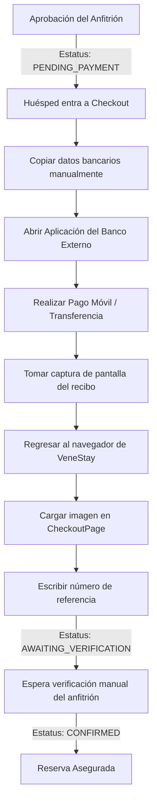
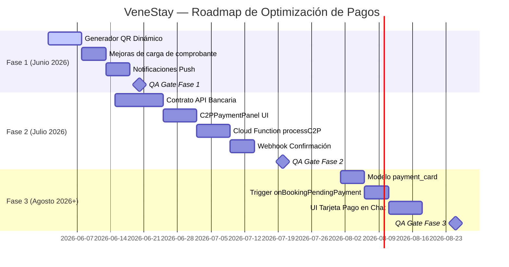

# Informe Estratégico: Optimización y Reducción de Fricción en el Proceso de Pago
**VeneStay v2.3.0+ — Plan de Implementación por Fases**
*Documento de Producto & Arquitectura · División de Ingeniería de IA — Antigravity · Mayo 2026*

---

## 1. Diagnóstico: Flujo de Pago Actual y Fricciones

En el modelo actual, el huésped atraviesa un proceso manual y asíncrono de 9 pasos para pagar el depósito del 20% (protocolo UCP) y asegurar su reserva:



### 1.1 Puntos de Fricción Críticos

| # | Punto de Fricción | Causa Raíz | Impacto en Conversión |
| :--- | :--- | :--- | :--- |
| F-1 | **Abandono por cambio de app** | El huésped debe salir de VeneStay para abrir su banco | ALTO — Pérdida directa |
| F-2 | **Errores de digitación de datos bancarios** | Copiado manual de teléfono, cédula, banco | MEDIO — Genera recargas y soporte |
| F-3 | **Dependencia de carga de imagen** | Formatos incompatibles, peso excesivo, red lenta | MEDIO — Checkout bloqueado |
| F-4 | **Espera asíncrona sin retroalimentación** | Verificación manual tarda horas (`AWAITING_VERIFICATION`) | ALTO — Abandono post-pago |
| F-5 | **Sesión expirada al regresar** | El usuario tarda en hacer el pago externo | BAJO — Requiere reiniciar checkout |

---

## 2. Visión del Flujo Objetivo (Frictionless)

El estado final al que queremos llegar es un proceso de **3 clics en pantalla**, sin salir de la aplicación:

```mermaid
sequenceDiagram
    autonumber
    actor Guest as Huésped
    participant APP as App VeneStay
    participant Gateway as Pasarela C2P / QR Engine
    participant FS as Firestore / Cloud Functions

    Note over Guest, Gateway: FLUJO OBJETIVO — 3 PASOS, SIN SALIR DE LA APP
    Guest->>APP: Ver reserva aprobada → Clic en "Pagar Seña"
    APP->>Gateway: Generar transacción dinámica (20% UCP, tasa BCV activa)
    Gateway-->>APP: Retornar QR Dinámico + formulario C2P pre-llenado

    rect rgb(20, 30, 45)
        Note over Guest, APP: Pago Express en pantalla
        Guest->>APP: Ingresar Teléfono, Cédula y OTP bancario
        Guest->>APP: Presionar "Pagar Ahora"
    end

    APP->>Gateway: Procesar C2P en tiempo real
    Gateway-->>FS: Webhook de confirmación bancaria
    FS-->>APP: Cambiar status → CONFIRMED automáticamente
    APP-->>Guest: 🎉 ¡Reserva Confirmada al instante!
```



---

## 3. Plan de Implementación por Fases

La implementación se divide en **3 Fases progresivas** que van desde mejoras de UX inmediatas (sin integraciones de terceros) hasta la automatización completa con APIs bancarias.

---

### 🟢 FASE 1 — Fundación: QR Asistido + UX Sin Fricción
**Sprint objetivo:** Fase 3 del Roadmap (Junio 2026) · **Complejidad:** BAJA · **Dependencias externas:** Ninguna

Esta fase elimina las fricciones más costosas (F-1, F-2, F-3) sin requerir ninguna integración bancaria. Todo se implementa dentro del stack actual de VeneStay (React + Firebase + Cloud Functions).

#### Cambios Incluidos:

**1A. Generador de QR Estático Inteligente (`CheckoutPage.tsx`)**
* El sistema genera un código QR con los datos de Pago Móvil del anfitrión **pre-llenados** (teléfono, banco, cédula).
* El monto exacto en VES se calcula en tiempo real con la tasa BCV guardada en Firestore.
* El concepto incluye automáticamente la referencia única de la reserva (`bookingId`).
* El huésped escanea el QR desde su app bancaria: todos los campos aparecen rellenos, solo debe confirmar.
* **Tecnología:** Librería `qrcode.react` (ya compatible con el stack). Cloud Function lee datos bancarios del anfitrión y genera el payload del QR desde el servidor.

**1B. Carga de Comprobante Mejorada**
* Se permite pegar una imagen desde el **portapapeles** (Ctrl+V / Share desde galería) además del selector de archivos.
* Se implementa compresión automática de imágenes del lado del cliente (máx. 800KB) antes del upload a Firebase Storage para evitar timeouts en redes lentas.
* Feedback visual en tiempo real del upload (barra de progreso, estado, nombre del archivo).

**1C. Notificación Push al Huésped Post-Pago**
* Una vez que el anfitrión marca la reserva como `CONFIRMED`, se dispara una notificación (vía Firebase Cloud Messaging) que abre la app directamente en la reserva confirmada.
* Elimina la espera incierta del huésped (F-4).

```
Flujo Fase 1:
Huésped → Escanea QR (datos pre-llenados) → Paga en su banco
→ Vuelve a VeneStay → Pega imagen desde clipboard / sube archivo comprimido
→ Anfitrión confirma → Notificación Push CONFIRMED al instante
```

#### Criterios de Aceptación (QA Gate Fase 1):
- [ ] CA-1: El QR se genera correctamente con los datos bancarios del anfitrión activo.
- [ ] CA-2: El monto en VES refleja la tasa BCV activa al momento de abrir el checkout.
- [ ] CA-3: El `bookingId` aparece como concepto de la transferencia en el QR.
- [ ] CA-4: La carga por portapapeles funciona en Chrome y Safari (móvil y escritorio).
- [ ] CA-5: Imágenes mayores a 800KB se comprimen antes de subir sin pérdida perceptible de calidad.
- [ ] CA-6: La notificación push llega al huésped en menos de 5 segundos post-confirmación.
- [ ] CA-7: `npm run lint` y `npx tsc --noEmit` pasan sin errores.

---

### 🟡 FASE 2 — Aceleración: C2P Nativo en Pantalla
**Sprint objetivo:** Fase 4 del Roadmap (Julio 2026) · **Complejidad:** ALTA · **Dependencias externas:** API Bancaria C2P (Banesco / Provincial / Mercantil)

Esta fase implementa el **Pago Móvil inverso (C2P)** directamente dentro de VeneStay, eliminando completamente la necesidad de salir de la aplicación (F-1 y F-5).

#### Cambios Incluidos:

**2A. Componente `C2PPaymentPanel` en CheckoutPage**
* Panel de formulario dentro del checkout con los campos: Número de teléfono, Banco emisor (selector), Cédula de identidad, Código OTP.
* La UI se renderiza como alternativa al flujo de carga de comprobante. El huésped puede elegir entre:
  * `[Pagar con Pago Móvil C2P]` (Fase 2)
  * `[Pagar externamente y subir comprobante]` (Fase 1 — mantener como fallback)

**2B. Cloud Function `processC2PTransaction`**
* Función serverless que actúa como intermediaria segura entre VeneStay y la API bancaria.
* El cliente **nunca** llama a la API bancaria directamente. Todo pasa por el servidor (seguridad de claves API).
* Recibe: `{ bookingId, phoneNumber, bankCode, cedula, otp, amount }`.
* Ejecuta la transacción C2P con el banco emisor del huésped.
* En caso de éxito: actualiza el `booking.status` a `CONFIRMED` vía Admin SDK.
* En caso de fallo: devuelve el código de error bancario al cliente para que el huésped pueda corregir.

**2C. Webhook de Confirmación Bancaria**
* Endpoint HTTPS público (Cloud Function) que recibe la confirmación asíncrona del banco como respaldo.
* Si el callback de la API directa falla, el webhook actúa como segundo canal de confirmación.
* Valida la firma (HMAC) del banco para prevenir webhooks fraudulentos.

#### Prerequisitos Técnicos para Fase 2:
- Contrato comercial activo con al menos un banco venezolano que provea API C2P (Banesco API es la más documentada).
- Credenciales de API almacenadas en **Google Secret Manager** (no en `.env` versionado).
- Cuenta mercantil del negocio VeneStay registrada en el banco como comercio habilitado para C2P.

#### Criterios de Aceptación (QA Gate Fase 2):
- [ ] CA-1: La transacción C2P de prueba con credenciales sandbox procesa correctamente.
- [ ] CA-2: El status de la reserva cambia a `CONFIRMED` en menos de 3 segundos tras aprobación del banco.
- [ ] CA-3: Los errores bancarios (saldo insuficiente, OTP incorrecto, cuenta bloqueada) se muestran con mensaje claro en español al huésped.
- [ ] CA-4: El endpoint del webhook rechaza peticiones con firma HMAC inválida (retorna 401).
- [ ] CA-5: Las credenciales de API bancaria NO aparecen en logs, consola ni en el código fuente (auditoría de seguridad).
- [ ] CA-6: El fallback de "subir comprobante" sigue funcionando sin regresiones.

---

### 🔵 FASE 3 — Ecosistema Conversacional: Pago en el Chat Seguro
**Sprint objetivo:** Post-lanzamiento Beta (Agosto 2026+) · **Complejidad:** MUY ALTA · **Dependencias externas:** Fase 2 completada + Firebase Functions v2

Esta fase convierte el chat de reserva en el canal de pago principal para reservas ya aprobadas, concentrando toda la interacción post-solicitud en una sola ventana conversacional.

#### Cambios Incluidos:

**3A. Tarjeta de Pago Interactiva en el Chat (`FloatingChat`)**
* Cuando una reserva pasa a `PENDING_PAYMENT`, el sistema (via Cloud Function trigger) inyecta automáticamente un mensaje especial de tipo `payment_card` en el chat de la reserva.
* La tarjeta muestra: monto del anticipo, método de pago preferido del anfitrión, QR dinámico y botón **"Pagar Ahora"**.
* Al presionar el botón, se abre el panel C2P directamente dentro del chat (sin navegar al checkout).

**3B. Nuevo tipo de mensaje `payment_card` en el modelo de datos**
```typescript
// src/types/message.types.ts — nuevo tipo
interface PaymentCardMessage extends BaseMessage {
  type: 'payment_card';
  paymentDetails: {
    bookingId: string;
    amount: number;
    currency: 'VES' | 'USDT';
    qrPayload: string;
    expiresAt: Timestamp; // El QR expira en 30 minutos
  };
}
```

**3C. Cloud Function Trigger `onBookingPendingPayment`**
* Se dispara automáticamente con `onDocumentUpdated` cuando `booking.status` cambia a `PENDING_PAYMENT`.
* Crea el mensaje `payment_card` en la colección `messages` para que el huésped lo vea en el chat.

#### Criterios de Aceptación (QA Gate Fase 3):
- [ ] CA-1: La tarjeta de pago aparece en el chat en menos de 2 segundos tras la aprobación del anfitrión.
- [ ] CA-2: El QR incrustado en la tarjeta expira a los 30 minutos y muestra un estado "Vencido" claro.
- [ ] CA-3: El pago desde el chat actualiza el status de la reserva idénticamente al flujo del checkout.
- [ ] CA-4: El anfitrión ve en su panel que la reserva pasó a `CONFIRMED` sin acción adicional suya.

---

## 4. Comparación de Impacto por Fase

| Métrica | Flujo Actual | Fase 1 (QR + UX) | Fase 2 (C2P Nativo) | Fase 3 (Chat) |
| :--- | :--- | :--- | :--- | :--- |
| **Tiempo de completado** | 5–15 min | 2–5 min | **< 60 segundos** | **< 30 segundos** |
| **Pasos requeridos** | 9 manuales | 5 asistidos | **3 integrados** | **2 en pantalla** |
| **Salida del ecosistema** | Sí (banco externo) | Sí (banco externo) | **No** | **No** |
| **Verificación** | Manual (horas) | Manual (horas) | **Automática (3s)** | **Automática (3s)** |
| **Tasa de abandono estimada** | Media-Alta | Media-Baja | **Mínima** | **Mínima** |
| **Dependencia externa** | Ninguna | Ninguna | API Bancaria C2P | API Bancaria C2P |
| **Complejidad de impl.** | — | BAJA | ALTA | MUY ALTA |
| **Sprint objetivo** | — | Junio 2026 | Julio 2026 | Agosto 2026+ |

---

## 5. Riesgos y Mitigaciones

| Riesgo | Probabilidad | Impacto | Mitigación |
| :--- | :--- | :--- | :--- |
| Banco no provee API C2P estable | Media | Alto (Fase 2) | Mantener Fase 1 como fallback permanente |
| OTP del cliente expira antes de confirmar | Baja | Medio | Extender sesión de checkout a 30 min + alerta de tiempo |
| QR escaneado por tercero | Muy Baja | Bajo | QR con TTL de 15 min + HMAC firmado con bookingId |
| Webhook bancario no llega (timeout) | Baja | Alto | Cloud Scheduler para polling de estado cada 30s |
| Regulatoria: banco bloquea C2P para comercios | Media | Alto (Fase 2) | Investigar marco legal VE antes de firmar contrato |

---

## 6. Secuencia de Implementación Recomendada



---

*Elaborado por la División de Ingeniería de IA — Antigravity*
*VeneStay v2.3.0+ · Documento de Producto & Arquitectura · Mayo 2026*
*Referencia: `docs/audits/informe_optimizacion_checkout.md` · `docs/plans/INFORME_SOLICITAR_RESERVA_VENESTAY.md`*
