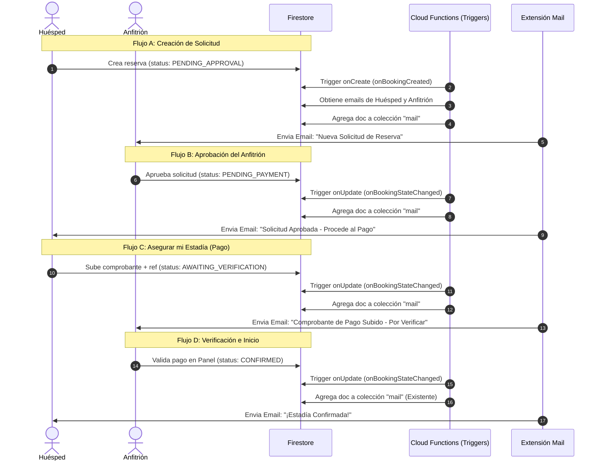

# Plan de Implementación: Sistema de Notificaciones por Correo Electrónico v1.0

> **Versión:** 1.0 — Diseño del Flujo de Notificaciones y Asegurar mi Estadía (Sprint 4)
> **Fecha:** 2026-06-07
> **Contexto:** Beta de Lechería (Julio 2026)

---

## 0. Análisis de Arquitectura y Enfoque

El proyecto VeneStay utiliza **Firebase Firestore** como base de datos y cuenta con **Cloud Functions** en NodeJS/TypeScript para la lógica de backend. 

### Patrón de Envío Existente
El proyecto ya implementa la extensión **"Trigger Email from Firestore"**. Para enviar un correo, la aplicación (típicamente a través de Cloud Functions) crea un documento en la colección de Firestore `mail`. La extensión detecta esta creación y envía el correo usando un proveedor configurado (ej. SendGrid o Mailgun).
El documento en `mail` tiene el siguiente esquema:
```typescript
interface MailDocument {
  to: string;
  message: {
    subject: string;
    html: string;
  };
}
```

### Decisión de Diseño: Triggers en Backend (Cloud Functions)
Toda la lógica de notificaciones por email debe ejecutarse **exclusivamente en Cloud Functions** a través de escuchas de base de datos (`onCreate` y `onUpdate` en Firestore).
**Razones de Seguridad y UX:**
1. **Seguridad de Datos:** La lectura de correos electrónicos (`users/{uid}/email`) de las partes involucradas (huésped y anfitrión) se realiza de forma segura en el backend. Las reglas de seguridad de Firestore bloquean el acceso cruzado de usuarios a perfiles ajenos, por lo que el frontend de un huésped no puede leer el email del anfitrión ni viceversa.
2. **Desacoplamiento (UX):** El frontend realiza operaciones rápidas en la base de datos (actualizar el estado de la reserva) sin esperar a que se procese o envíe el correo.
3. **Idempotencia y Resiliencia:** El backend puede marcar campos como `emailSentAt` de forma atómica en transacciones para evitar envíos duplicados en caso de reintentos.

---

## 1. Objetivo

Implementar un sistema de notificaciones automáticas por correo electrónico para mantener informados a huéspedes y anfitriones durante el ciclo de vida de una reserva y verificación de perfil, con especial énfasis en el flujo crítico de **"Asegurar mi Estadía"** (carga y verificación de pagos) y la aprobación de la solicitud inicial.

---

## 2. Flujo Crítico de Notificaciones en la Reserva

A continuación, se detalla el ciclo de vida de una reserva bajo el modelo **UCP 20/80** (20% garantía, 80% al check-in) y los triggers de email correspondientes:



---

## 3. Matriz de Notificaciones Requeridas (Análisis de Brechas)

Tras analizar el proyecto, se detectaron las siguientes necesidades clave de notificaciones por email:

| ID | Evento Desencadenante | Destinatario | Estado Reserva / KYC | Importancia / Justificación |
|---|---|---|---|---|
| **E-01** | Nueva solicitud de reserva creada | Anfitrión | `PENDING_APPROVAL` | **Alta**: El anfitrión tiene 24 horas para responder antes de que la reserva expire automáticamente. |
| **E-02** | Solicitud aprobada por el anfitrión | Huésped | `PENDING_PAYMENT` | **Alta**: Inicia el tiempo límite de 24 horas para subir el pago y asegurar la estadía. |
| **E-03** | Huésped sube comprobante de pago | Anfitrión | `AWAITING_VERIFICATION` | **Crítica (Asegurar mi Estadía)**: El anfitrión debe ser notificado de inmediato para verificar la cuenta bancaria y confirmar el bloqueo definitivo de fechas. |
| **E-04** | Pago verificado y confirmado | Huésped | `CONFIRMED` | **Alta**: Confirmación formal de la reserva (Ya implementada parcialmente para el huésped). |
| **E-05** | Solicitud rechazada (o pago rechazado) | Huésped | `REJECTED` | **Media**: Informa al huésped que su solicitud o pago no fue aceptado, junto con la nota aclaratoria. |
| **E-06** | Expiración de reserva por tiempo límite | Huésped y Anfitrión | `EXPIRED` | **Media**: El cron job cancela la reserva. Es clave avisar al huésped por qué se liberaron las fechas. |
| **E-07** | Aprobación de KYC (Pasaporte) | Usuario | KYC `VERIFIED` | **Alta**: El usuario ahora tiene +40 de Trust Score y está habilitado para realizar transacciones. |
| **E-08** | Rechazo de KYC (Pasaporte) | Usuario | KYC `REJECTED` | **Alta**: Informa detalladamente por qué se rechazó el documento (ej. foto borrosa) para que pueda re-intentarlo. |
| **E-09** | Solicitud de reprogramación de fechas | Contraparte | `RESCHEDULE_REQUESTED` | **Media**: Notifica al anfitrión o al huésped que se ha propuesto un cambio de fechas. |

---

## 4. Diseño de Plantillas HTML (Identidad Visual VeneStay)

Las plantillas de correo respetarán rigurosamente el sistema de diseño premium de VeneStay:
*   **Fondo Base / Cabeceras:** Navy (`#0B1120`)
*   **Acentos y Botones:** Oro (`#C5A059`)
*   **Contenedor Principal:** Blanco (`#FFFFFF`) con bordes redondeados modernos.
*   **Tipografía:** Sin-serif (Arial, Helvetica) con jerarquías claras.

### Componente Común: Estilos CSS y Estructura
```html
<style>
  body { font-family: Arial, sans-serif; background-color: #f5f7fa; margin: 0; padding: 20px; -webkit-font-smoothing: antialiased; }
  .container { max-width: 600px; margin: 0 auto; background-color: #ffffff; border-radius: 16px; overflow: hidden; border: 1px solid #e8ecef; box-shadow: 0 4px 12px rgba(0,0,0,0.03); }
  .header { background-color: #0B1120; color: #ffffff; padding: 32px; text-align: center; }
  .header-logo { color: #C5A059; font-size: 24px; font-weight: 900; letter-spacing: 0.05em; text-transform: uppercase; }
  .header-sub { color: #94a3b8; font-size: 11px; letter-spacing: 0.2em; text-transform: uppercase; margin-top: 6px; font-weight: bold; }
  .body { padding: 40px 32px; color: #334155; line-height: 1.6; }
  .title { font-size: 20px; font-weight: 800; color: #0B1120; margin-top: 0; margin-bottom: 8px; }
  .text { font-size: 14px; color: #475569; margin-bottom: 24px; }
  .details-box { background-color: #f8fafc; border: 1px solid #f1f5f9; border-radius: 12px; padding: 20px; margin-bottom: 24px; }
  .details-title { font-size: 11px; font-weight: 800; text-transform: uppercase; letter-spacing: 0.1em; color: #C5A059; margin-bottom: 12px; }
  .row { display: flex; justify-content: space-between; font-size: 13px; padding: 6px 0; border-bottom: 1px solid #f1f5f9; }
  .row:last-child { border-bottom: none; }
  .row-label { color: #64748b; font-weight: 600; }
  .row-value { color: #0f172a; font-weight: 700; text-align: right; }
  .button-container { text-align: center; margin: 32px 0 12px 0; }
  .btn-primary { display: inline-block; background-color: #C5A059; color: #0B1120 !important; font-size: 12px; font-weight: 800; text-decoration: none; padding: 14px 32px; border-radius: 10px; text-transform: uppercase; letter-spacing: 0.1em; box-shadow: 0 4px 10px rgba(197, 160, 89, 0.2); }
  .note-box { background-color: #fffbeb; border: 1px solid #fef3c7; border-left: 4px solid #C5A059; border-radius: 8px; padding: 14px 16px; margin-bottom: 24px; font-size: 13px; color: #78350f; font-style: italic; }
  .footer { background-color: #f8fafc; padding: 24px; text-align: center; font-size: 11px; color: #94a3b8; border-top: 1px solid #e2e8f0; }
</style>
```

---

## 5. Cambios Propuestos por Archivo

### [Componente: Cloud Functions Backend]

#### [MODIFY] [booking.functions.ts](file:///c:/VeneStay/functions/src/booking.functions.ts)
Implementaremos las siguientes adiciones y modificaciones:

1.  **[NUEVO] Trigger `onBookingCreated`:**
    *   Escucha la ruta `bookings/{bookingId}` al crearse.
    *   Si `status === 'PENDING_APPROVAL'`, obtiene el email del anfitrión (`ownerId`) y envía el email **E-01 (Nueva Solicitud de Reserva)**.
2.  **[MODIFICAR] Trigger `onBookingStateChanged`:**
    *   Añadir control de idempotencia mediante marcas de tiempo en el documento de reserva para evitar duplicados en el envío de emails:
        *   `paymentInstructionsEmailSentAt` para `PENDING_PAYMENT`.
        *   `paymentSubmittedEmailSentAt` para `AWAITING_VERIFICATION`.
        *   `rejectionEmailSentAt` para `REJECTED`.
    *   Implementar en la máquina de estados:
        *   **Caso `PENDING_PAYMENT` (Aprobación inicial):** Envía el email **E-02 (Instrucciones de Pago)** al huésped.
        *   **Caso `AWAITING_VERIFICATION` (Pago subido):** Envía el email **E-03 (Verificación de Pago Requerida)** al anfitrión.
        *   **Caso `REJECTED`:** Envía el email **E-05 (Solicitud Rechazada)** al huésped con el motivo (`rejectionReason`).
3.  **[NUEVAS] Funciones Auxiliares de Construcción de HTML:**
    *   `buildBookingRequestEmailHTML()`
    *   `buildPaymentInstructionsEmailHTML()`
    *   `buildPaymentSubmittedEmailHTML()`
    *   `buildRejectionEmailHTML()`

#### [NEW] [kyc.functions.ts](file:///c:/VeneStay/functions/src/kyc.functions.ts) (Trigger de Actualización de KYC)
1.  **[NUEVO] Trigger `onKYCStatusChanged`:**
    *   Escucha la ruta `users/{uid}` con un disparador `.onUpdate`.
    *   Verifica si `before.kycStatus !== after.kycStatus`.
    *   **Caso `VERIFIED`:** Envía el email **E-07 (KYC Aprobado)** felicitando al usuario y detallando su nuevo Trust Score (+40).
    *   **Caso `REJECTED`:** Envía el email **E-08 (KYC Rechazado)** indicando la nota de rechazo redactada por el auditor/admin (`kycRejectionNote`).

#### [MODIFY] [index.ts](file:///c:/VeneStay/functions/src/index.ts)
*   Asegurar la exportación de los nuevos triggers para que sean detectados e inicializados por el Firebase Cloud Runtime.
    ```typescript
    export { onBookingCreated, onBookingStateChanged, cronCancelExpiredBookings, getProofSignedURL } from './booking.functions';
    export { submitKYCDocument, approveKYC, rejectKYC, getKYCDocumentSignedURL, onKYCStatusChanged } from './kyc.functions';
    ```

---

## 6. Detalles de los Flujos de Correo y Plantillas

### E-01: Nueva Solicitud (Huésped -> Anfitrión)
*   **Asunto:** `Nueva solicitud de reserva para ${listingTitle} — VeneStay`
*   **Cuerpo HTML:** Informa al anfitrión que tiene un cliente interesado. Muestra:
    *   Nombre del huésped.
    *   Fechas de estadía y noches.
    *   Huéspedes permitidos.
    *   **Ganancia neta esperada** (calculada con el Commission Tier actual).
    *   Mensaje personal del huésped (`guestMessage`).
    *   Botón para ir a verificar la solicitud en el dashboard.

### E-02: Solicitud Aprobada (Anfitrión -> Huésped)
*   **Asunto:** `Tu solicitud en ${listingTitle} fue aprobada — Procede al pago`
*   **Cuerpo HTML:** Informa al huésped que el anfitrión aceptó su estadía. Muestra:
    *   Mensaje o nota del anfitrión (`hostResponseNote`).
    *   **Monto del Anticipo (20%)** a transferir.
    *   Instrucciones de pago del anfitrión (`paymentInstructions`).
    *   Advertencia de expiración (Límite de 24 horas para subir el pago antes de que se cancele la reserva).
    *   Botón de llamada a la acción: "Subir comprobante de pago".

### E-03: Asegurar mi Estadía - Pago Subido (Huésped -> Anfitrión)
*   **Asunto:** `Comprobante de pago recibido para ${listingTitle} — Verificación requerida`
*   **Cuerpo HTML:** Notifica al anfitrión que el huésped ha subido su comprobante. Muestra:
    *   Número de referencia del pago.
    *   Monto de la garantía (20%).
    *   Enlace al comprobante (usando la imagen cargada en Firebase Storage).
    *   Botón directo al Dashboard para "Validar Pago" y asegurar la estadía.

### E-05: Solicitud Rechazada (Anfitrión -> Huésped)
*   **Asunto:** `Actualización de tu solicitud para ${listingTitle} — VeneStay`
*   **Cuerpo HTML:** Informa amablemente del rechazo. Muestra:
    *   El motivo de rechazo (`rejectionReason`).
    *   Invitación a buscar otros alojamientos disponibles en la zona.

---

## 7. Criterios de Aceptación (QA Gate Checklist)

- [ ] **CA-1:** Al crear una reserva en modo solicitud, se crea un documento en la colección `mail` dirigido al email del anfitrión con los datos correctos de la reserva.
- [ ] **CA-2:** Al cambiar el estado de la reserva a `PENDING_PAYMENT`, se crea un documento en `mail` dirigido al huésped con las instrucciones de pago detalladas y el cálculo del 20%.
- [ ] **CA-3:** Al subir el comprobante de pago (cambio de estado a `AWAITING_VERIFICATION`), se crea un documento en `mail` dirigido al anfitrión con el número de referencia.
- [ ] **CA-4:** Al cambiar el estado de KYC de un usuario a `VERIFIED` o `REJECTED`, se envía el correo correspondiente al email del usuario.
- [ ] **CA-5:** Se incluye control de idempotencia (`*EmailSentAt`) para evitar reenvíos en ejecuciones duplicadas de Cloud Functions.
- [ ] **CA-6:** La compilación de TypeScript en Cloud Functions (`tsc` en directorio `functions/`) pasa sin errores.
- [ ] **CA-7:** Las plantillas HTML son totalmente responsivas, utilizan la paleta de colores de VeneStay (`#0B1120`, `#C5A059`) y no contienen placeholders o texto genérico.

---

## 8. Plan de Verificación

### Pruebas Automatizadas
*   Correr test suite de integración local usando Firebase Emulator.
*   Verificar la inserción de documentos en la colección emulada `mail` y validar su estructura Zod/JSON.

### Pruebas Manuales
1.  **Registro y Solicitud:** Crear un huésped de prueba y solicitar una propiedad. Verificar en el emulador de Firestore que se haya insertado un correo en `mail` para el email del host.
2.  **Aprobación del Host:** En el panel del host, aprobar la solicitud ingresando la nota y las instrucciones. Verificar el correo en `mail` del huésped con el aviso de 24h de expiración y el botón para pagar.
3.  **Subida de Pago:** Subir un comprobante (simulado). Verificar que se genera la alerta para el anfitrión con la referencia exacta.
4.  **Confirmación y KYC:** Validar el pago y simular la aprobación de KYC de un usuario. Verificar que se envían ambos correos correspondientes.
