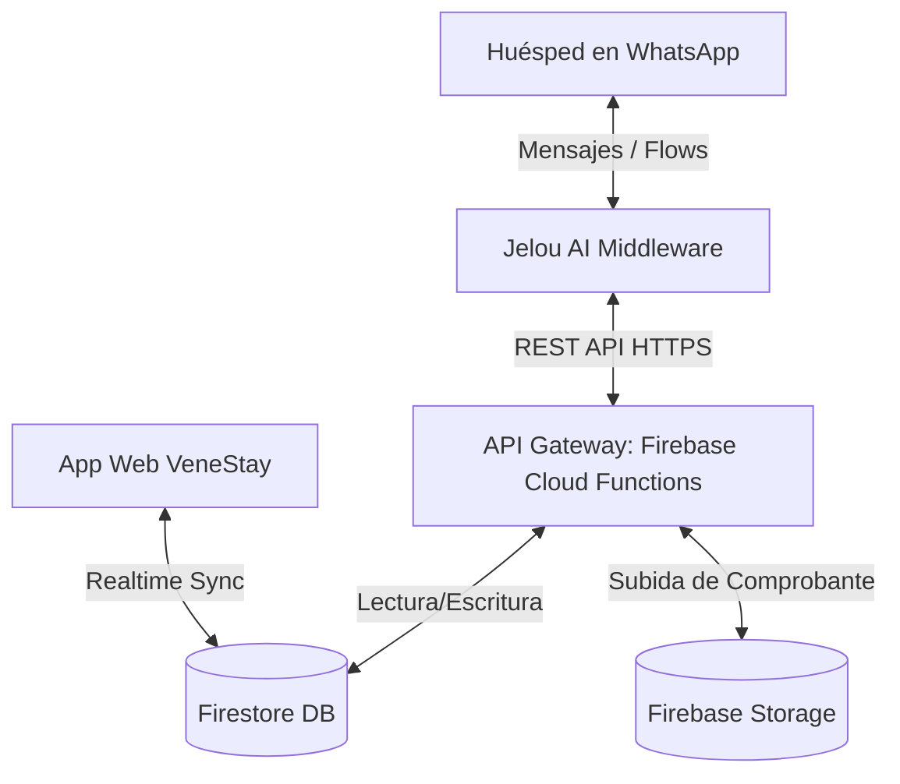
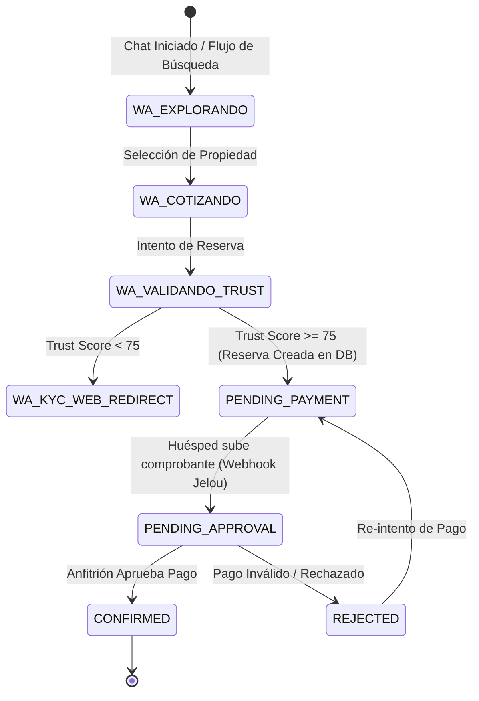

# RFC: VeneStay Conversational Commerce (WhatsApp & Jelou AI Integration)

- **Estado**: APROBADO (Backlog Post-Lanzamiento)
- **Autor**: Planificador y Arquitecto de Sistemas Integrados
- **Fecha**: 2026-06-04
- **Versión**: v1.0.0

---

## 1. Arquitectura de Integración (System Overview)

El sistema de **VeneStay Conversational Commerce** permite que un huésped realice el descubrimiento de propiedades, validación de identidad/seguridad (Trust Score) y la reserva (Protocolo UCP 20/80) directamente desde WhatsApp. **Jelou AI** actúa como middleware de procesamiento de lenguaje natural (NLP) y orquestador de **WhatsApp Flows**, conectándose con el backend de VeneStay alojado en **Firebase (Cloud Functions & Firestore)**.



---

## 2. Diseño del API Gateway (Firebase Cloud Functions)

El endpoint base expuesto por VeneStay a Jelou AI será `https://<region>-<project-id>.cloudfunctions.net/api/whatsapp`. 
Todas las peticiones entrantes deben autenticarse mediante un token Bearer en el encabezado `Authorization` (`Authorization: Bearer <JELOU_SHARED_SECRET>`) y validarse con firmas HMAC de Jelou AI para evitar spoofing.

### 2.1 Consultar Disponibilidad
- **Endpoint**: `GET /api/whatsapp/listings`
- **Descripción**: Permite a Jelou AI buscar propiedades disponibles según filtros de ubicación, rango de precios, cantidad de huéspedes y fechas.
- **Query Parameters**:
  - `city` (string, requerido)
  - `checkIn` (string/ISO-8601, opcional)
  - `checkOut` (string/ISO-8601, opcional)
  - `guests` (number, opcional, por defecto `1`)

**Response (`200 OK`):**
```json
{
  "success": true,
  "data": [
    {
      "listingId": "lst_lecheria_001",
      "title": "Apartamento Premium Vista al Mar - Complejo El Morro",
      "pricePerNight": 120.00,
      "currency": "USD",
      "cleaningFee": 30.00,
      "maxGuests": 4,
      "amenities": ["Wifi", "Piscina", "A/C", "Parrillera"],
      "images": [
        "https://firebasestorage.googleapis.com/v0/b/venestay.appspot.com/o/listings%2Flst_001_main.jpg"
      ]
    }
  ]
}
```

### 2.2 Validar Trust Score
- **Endpoint**: `POST /api/whatsapp/validate-trust`
- **Descripción**: Determina si el número de teléfono del usuario cumple con los estándares de seguridad mínimos (Trust Score >= 75) para proceder al Flujo Corto de Reserva sin fricción manual.
- **Request Body**:
```json
{
  "phoneNumber": "+584123456789",
  "whatsappName": "Carlos Zabala"
}
```

**Response (`200 OK` - Aprobado):**
```json
{
  "success": true,
  "allowed": true,
  "trustScore": 88,
  "reason": "Perfil con KYC verificado e historial transaccional positivo."
}
```

**Response (`200 OK` - Rechazado / Requiere KYC Web):**
```json
{
  "success": true,
  "allowed": false,
  "trustScore": 45,
  "reason": "Número de teléfono sin historial y sin documento de identidad cargado. Requiere verificación KYC en canal web.",
  "redirectionUrl": "https://venestay.com/passport/verify?phone=%2B584123456789"
}
```

### 2.3 Crear Intención de Reserva (Protocolo UCP 20/80)
- **Endpoint**: `POST /api/whatsapp/bookings`
- **Descripción**: Registra una reserva en estado temporal y devuelve el desglose financiero del depósito (20%) y el pago en sitio (80%).
- **Request Body**:
```json
{
  "phoneNumber": "+584123456789",
  "listingId": "lst_lecheria_001",
  "checkIn": "2026-07-10",
  "checkOut": "2026-07-15",
  "guests": 2
}
```

**Response (`201 Created`):**
```json
{
  "success": true,
  "bookingId": "bk_wa_998822",
  "status": "PENDING_PAYMENT",
  "financials": {
    "nights": 5,
    "pricePerNight": 120.00,
    "cleaningFee": 30.00,
    "totalPrice": 630.00,
    "depositRequired20": 126.00,
    "paymentAtCheckIn80": 504.00,
    "currency": "USD"
  },
  "bankAccounts": [
    {
      "bankName": "Banesco",
      "accountNumber": "0134-XXXX-XX-XXXXXXXXXX",
      "holderName": "VeneStay Lechería C.A.",
      "idNumber": "J-12345678-9",
      "pagoMovil": {
        "phone": "+584141234567",
        "idNumber": "J-12345678-9"
      }
    }
  ]
}
```

---

## 3. Mapeado de la Máquina de Estados (State Machine)

El ciclo de vida de una reserva iniciada en WhatsApp progresa a través de estados conversacionales controlados por Jelou AI, mapeados directamente a la colección `bookings` en Firestore.



### 3.1 Mapeo de Acciones del Webhook de Jelou AI a Firestore

| Evento Conversacional (WhatsApp / Jelou) | Acción de Middleware | Estado Resultante en Firestore (`bookings.status`) |
|:---|:---|:---|
| Usuario selecciona fechas y confirma intención | Jelou invoca `POST /bookings` | `PENDING_PAYMENT` |
| Usuario envía adjunto / imagen de transferencia | Jelou sube imagen a Storage y envía Webhook | `PENDING_APPROVAL` |
| Expiración de tiempo (30 min sin pago) | Jelou/Firebase Cron cancela reserva temporal | `CANCELLED` |
| Usuario solicita cambio de fecha en chat | Jelou invoca pre-validación de cambio | `RESCHEDULE_PENDING` (Si es aprobado por anfitrión) |

### 3.2 Manejo de Comprobantes de Pago a Firebase Storage
Cuando Jelou AI recibe un mensaje multimedia que contiene una imagen o documento de comprobante de pago, debe realizar la transferencia directa al bucket de almacenamiento de VeneStay:
1. **Ruta de Almacenamiento**: `/payment-proofs/{bookingId}/{timestamp}_proof.jpg`
2. **Método**: Jelou AI consumirá una URL de subida firmada (`POST /api/whatsapp/bookings/{bookingId}/generate-upload-url`) generada por Firebase Storage para subir directamente el archivo binario con los metadatos adecuados del remitente.
3. **Trigger de Firestore**: Al finalizar la subida exitosa, el backend actualiza la reserva:
```json
{
  "status": "PENDING_APPROVAL",
  "paymentProofUrl": "https://firebasestorage.googleapis.com/v0/b/venestay.appspot.com/o/payment-proofs%2Fbk_wa_998822%2F1717478400_proof.jpg",
  "paymentUploadedAt": "2026-06-04T05:36:00Z"
}
```

---

## 4. Sincronización Omnicanal del Historial de Chat

Para asegurar una experiencia transparente, si el huésped inicia el chat en WhatsApp y luego abre la App Web de VeneStay, debe ver todo el historial unificado.

### 4.1 Modelo de Datos en Firestore (`messages`)
Cada mensaje del chat conversacional se inserta en la subcolección `messages` bajo la ruta `/bookings/{bookingId}/messages/`.

```typescript
interface ChatMessage {
  id: string;              // ID único del mensaje
  senderId: string;        // 'system' | 'bot' | 'guest_phone' | 'host_uid'
  senderType: 'system' | 'bot' | 'guest' | 'host';
  text: string;            // Contenido textual del mensaje
  mediaUrl?: string;       // URL a imágenes, audios o comprobantes
  createdAt: string;       // Timestamp ISO-8601
  channel: 'whatsapp' | 'web'; // Canal de origen
  whatsappMessageId?: string; // ID único de mensaje provisto por Meta
}
```

### 4.2 Mecanismo de Sincronización Doble-Vía

1. **WhatsApp -> Firestore (Inbound)**:
   - Cada interacción recibida por el Webhook de Jelou AI es parseada e inyectada en la subcolección `/bookings/{bookingId}/messages/`.
   - La App Web de VeneStay (React) tiene una escucha en tiempo real (`onSnapshot`) sobre esta subcolección, renderizando de forma instantánea el mensaje en el componente de Chat del usuario.

2. **Web -> WhatsApp (Outbound)**:
   - Si el anfitrión o el soporte responde desde la App Web, el backend escribe en Firestore.
   - Una Cloud Function (`onDocumentCreated` en `/bookings/{bookingId}/messages/{messageId}`) intercepta el mensaje y, si `channel === 'web'`, realiza una llamada REST a la API de Jelou AI para enviar el mensaje de texto o plantilla de WhatsApp al número del huésped.

---

## 5. Estrategia de Rollout y Seguridad

- **Autenticación HMAC**: Jelou AI firmará los payloads con una clave secreta compartida configurada en las variables de entorno de Firebase Functions (`whatsapp.jelou_secret`).
- **Control de Inyección de Mensajes**: Solo los números telefónicos asociados a reservas activas o pre-registradas pueden escribir a la colección de chats correspondientes.
- **Rendimiento**: Búsquedas de disponibilidad (`GET /api/whatsapp/listings`) utilizarán cacheo local en memoria CDN de Firebase Hosting durante 60 segundos para evitar sobrecarga de consultas en periodos de alto tráfico promocional en WhatsApp.
