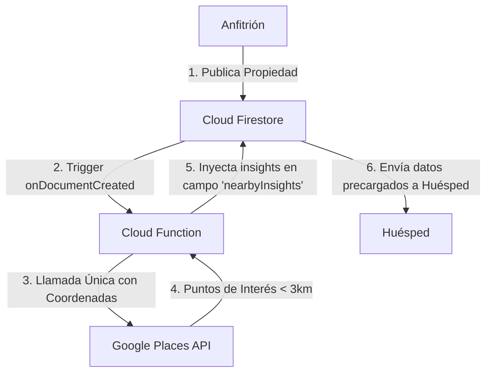

# Especificación Técnica (v2.2.0): Patrón Fetch on Publish (Puntos de Interés Cercanos)

Esta especificación describe la arquitectura serverless del patrón **Fetch on Publish** utilizado para indexar puntos de interés cercanos (embarcaderos, playas, comercios) en el ecosistema **VeneStay**.

---

## 1. Objetivo de Negocio y Técnico
*   **Reducción de Costos:** Reducir las costosas llamadas a Google Places API (Nearby Search / Place Details) en un 99.9%.
*   **Rendimiento en Cliente:** Garantizar que los huéspedes accedan de inmediato a información de interés en el detalle de la propiedad, reduciendo la latencia de renderizado y el tráfico de datos móviles en redes inestables.

---

## 2. Arquitectura del Patrón



---

## 3. Comportamiento y Reglas de Negocio
*   **Desencadenante:** Una Cloud Function de Firebase reacciona al evento `onDocumentCreated` (y `onDocumentUpdated` si cambian las coordenadas geográficas) en la colección `/listings/`.
*   **Radio de Búsqueda:** Búsqueda en un radio lineal de 3 kilómetros a la redonda de las coordenadas `latitude` y `longitude` de la propiedad.
*   **Filtrado:** Extrae únicamente los 5 puntos de interés más relevantes categorizados como facilidades náuticas (embarcaderos, marinas), accesos a playas, y comercios esenciales (bodegones, supermercados).
*   **Almacenamiento Estático:** La Cloud Function procesa, calcula distancias estimadas, e inyecta el desglose estructurado en un campo llamado `nearbyInsights` en el documento original del listado.

---

## 4. Estructura del Objeto de Insights (TypeScript)
```typescript
export interface NearbyInsight {
  placeId: string;
  name: string;
  category: 'NAUTICAL' | 'BEACH' | 'COMMERCIAL';
  distanceMeters: number;
  latitude: number;
  longitude: number;
}

// Extensión del modelo Listing
export interface Listing {
  // ... campos estándar
  nearbyInsights?: NearbyInsight[];
}
```
