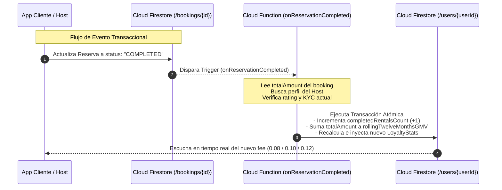

# Documento de Diseño Técnico (TDD): Sistema Gamificado de Niveles de Lealtad y Comisiones Dinámicas para Anfitriones (v2.3.0)

Este documento define la arquitectura de software, modelado de datos, flujo de eventos serverless y reglas de seguridad para la implementación del **Sistema de Niveles de Lealtad y Comisiones Dinámicas** en el ecosistema de **VeneStay (v2.3.0)**.

---

## 1. Contexto de Negocio y Objetivos Estratégicos

El marketplace premium de alquileres vacacionales **VeneStay** en Lechería busca resolver uno de los mayores problemas operativos de las plataformas P2P: la **desintermediación (leakage)**. Tras el contacto inicial en la plataforma, algunos huéspedes y anfitriones cancelan las reservas para transar de forma directa a través de canales externos como WhatsApp, evadiendo las comisiones de servicio.

Para mitigar esta fuga de ingresos y fomentar la retención de anfitriones calificados, se introduce este sistema gamificado de fidelidad. El principio básico es simple: **a mayor volumen de negocio concretado y mejor reputación dentro del ecosistema VeneStay, menor será la tasa de comisión cobrada al anfitrión**. Al ofrecer comisiones altamente competitivas (hasta un 8%), se desincentiva la desintermediación al compensar los riesgos de transar por fuera (estafas, falta de seguros, pérdida de visibilidad y reputación).

---

## 2. Reglas de Negocio y Matriz de Niveles (Tiers)

El sistema de lealtad evalúa de forma continua el desempeño del anfitrión basándose en una **ventana rodante de los últimos 365 días (1 año)** y su estado de verificación de identidad. Se establecen tres niveles diferenciados con una lógica híbrida basada en volumen y reputación:

### 2.1. Matriz de Parámetros de Clasificación

| Nivel (Tier) | Tasa de Comisión | Alquileres Concretados (365d) | Volumen Bruto / GMV (365d) | KYC Pasaporte VeneStay | Calificación Promedio (Reviews) |
| :--- | :--- | :--- | :--- | :--- | :--- |
| **Bronce** *(Base)* | **12%** (`0.12`) | $\ge 0$ | $\ge \$0$ USD | No Requerido | N/A |
| **Plata** *(Verificado)*| **10%** (`0.10`) | **> 10** alquileres | **OR > $3,000** USD | **Requerido (VERIFIED)** | $\ge 4.3$ estrellas |
| **Oro** *(Elite)* | **8%** (`0.08`) | **> 30** alquileres | **OR > $10,000** USD | **Requerido (VERIFIED)** | $\ge 4.7$ estrellas |

### 2.2. Lógica de Transición de Niveles

La evaluación del nivel se realiza siguiendo las siguientes compuertas lógicas estrictas:

```typescript
// Lógica para determinar el Tier de Lealtad del Anfitrión
function evaluateHostTier(stats: HostLoyaltyStats, kycStatus: string): 'BRONCE' | 'PLATA' | 'ORO' {
  const isKycVerified = kycStatus === 'VERIFIED';
  
  // Regla para Nivel Oro (Elite)
  const meetsOroVolume = stats.completedRentalsCount > 30 || stats.rollingTwelveMonthsGMV > 10000;
  const meetsOroReputation = stats.averageRating >= 4.7;
  if (meetsOroVolume && isKycVerified && meetsOroReputation) {
    return 'ORO';
  }
  
  // Regla para Nivel Plata (Verificado)
  const meetsPlataVolume = stats.completedRentalsCount > 10 || stats.rollingTwelveMonthsGMV > 3000;
  const meetsPlataReputation = stats.averageRating >= 4.3;
  if (meetsPlataVolume && isKycVerified && meetsPlataReputation) {
    return 'PLATA';
  }
  
  // Por defecto, cae en Bronce
  return 'BRONCE';
}
```

#### Aspectos Clave de la Transición:
1. **Hibridez del Volumen:** Un anfitrión puede calificar para Plata u Oro cumpliendo **cualquiera** de las dos métricas operacionales (conteo de alquileres concretados *o* volumen bruto de facturación - GMV). Esto apoya tanto a anfitriones de propiedades boutique de alta gama (pocas noches, alto valor en USD) como a anfitriones de estudios económicos con alta rotación.
2. **Restricción de Entrada (KYC):** Independientemente de cuántas transacciones o ingresos registre, un anfitrión **no podrá salir del nivel Bronce** si su estado de KYC en el *Pasaporte VeneStay* no es `VERIFIED`. Esta medida de seguridad blindará el ecosistema contra fraudes.
3. **Penalización por Reputación:** Si un anfitrión Oro recibe reseñas negativas recurrentes que bajen su rating promedio de los últimos 365 días por debajo de `4.7` (pero por encima de `4.3`), será **degradado automáticamente** al nivel Plata. Si baja de `4.3`, regresará a Bronce.

---

## 3. Modelado de Datos Eficiente en Cloud Firestore

### 3.1. Mitigación de Lecturas Masivas e Impacto de Costos

En Firestore, el costo de las consultas escala con el número de documentos leídos. Si realizáramos una consulta dinámica con `count()` o agregación en tiempo real de todas las reservas (`bookings`) de un anfitrión cada vez que se calcula un checkout o se carga su panel de control:
* Generaríamos decenas de miles de lecturas innecesarias por anfitrión activo.
* Generaríamos latencia perceptible para el huésped durante el cálculo del checkout.
* Expondríamos al sistema a fallas por cuellos de botella en bases de datos con alto tráfico.

**Estrategia de Optimización:** Almacenar de forma pre-calculada un objeto de agregación en el perfil de usuario llamado `HostLoyaltyStats` de forma desnormalizada. El backend serverless actualizará de forma atómica y aislada este objeto únicamente cuando ocurran eventos transaccionales discretos (como la culminación de un alquiler).

### 3.2. Interfaces de TypeScript (`src/features/auth/types/index.ts`)

Para soportar el sistema, ampliamos la interfaz de `UserProfile` para incluir la estructura `HostLoyaltyStats` y los atributos correspondientes:

```typescript
// src/features/auth/types/index.ts (Fragmento Actualizado)

export type LoyaltyTierType = 'BRONCE' | 'PLATA' | 'ORO';

export interface HostLoyaltyStats {
  /** Número total de alquileres marcados como COMPLETED en los últimos 365 días */
  completedRentalsCount: number;
  
  /** Volumen bruto total de reservas (GMV) completadas en los últimos 365 días (en USD) */
  rollingTwelveMonthsGMV: number;
  
  /** Tasa de comisión del servicio aplicada actualmente (0.12, 0.10, o 0.08) */
  currentCommissionRate: 0.12 | 0.10 | 0.08;
  
  /** Calificación promedio acumulada del anfitrión en los últimos 365 días */
  averageRating: number;
  
  /** Nivel de lealtad calculado actualmente */
  loyaltyTier: LoyaltyTierType;
  
  /** Timestamp ISO de la última vez que se recalculó el perfil */
  lastRecalculatedAt: string;
}

export interface UserProfile {
  uid: string;
  email: string | null;
  displayName: string | null;
  photoURL?: string | null;
  role: UserRole;
  createdAt: string | number | Date | { seconds: number; nanoseconds: number } | any;
  kycStatus?: KYCStatus;
  isVerified?: boolean;
  
  // Atributos de Lealtad (Nuevos campos)
  loyaltyStats?: HostLoyaltyStats;
  currentCommissionRate?: number; // Para compatibilidad rápida en el cálculo de checkout
}
```

---

## 4. Arquitectura de Eventos y Lógica Serverless

El recálculo del nivel de lealtad se divide en dos componentes tecnológicos complementarios:
1. **Actualización Incremental por Eventos (Cloud Functions Trigger):** Sincronización en tiempo real al finalizar reservas.
2. **Saneamiento Temporal (Scheduled Cloud Function / Cron):** Degradación periódica por antigüedad de reservas.



### 4.1. Trigger en Cloud Functions: `onReservationCompleted`

Este trigger se ejecuta en segundo plano cuando un documento en la colección `bookings` cambia su estado a `"COMPLETED"`. La lógica está construida bajo la especificación **Firebase Cloud Functions v2** para garantizar alto rendimiento y escalabilidad.

#### Código de Producción en TypeScript (Cloud Functions Backend)

```typescript
import { onDocumentUpdated } from "firebase-functions/v2/firestore";
import * as admin from "firebase-admin";

// Inicializar SDK si es necesario
if (!admin.apps.length) {
  admin.initializeApp();
}

const db = admin.firestore();

/**
 * Trigger que reacciona a la finalización de una reserva para actualizar las estadísticas de lealtad del anfitrión.
 */
export const onReservationCompleted = onDocumentUpdated({
  document: "bookings/{bookingId}",
  region: "us-central1"
}, async (event) => {
  const beforeData = event.data?.before.data();
  const afterData = event.data?.after.data();

  // 1. Validar pre-condiciones: Transición de estado estricta a COMPLETED
  if (!beforeData || !afterData) return;
  
  const statusChanged = beforeData.status !== "COMPLETED" && afterData.status === "COMPLETED";
  if (!statusChanged) {
    // Si no es una transición hacia "COMPLETED", ignoramos el procesamiento
    return;
  }

  const hostId = afterData.ownerId; // El ownerId de la reserva es el UID del anfitrión
  const bookingAmount = Number(afterData.totalAmount) || 0;

  if (!hostId) {
    console.error(`Error: La reserva completada ${event.params.bookingId} no posee ownerId.`);
    return;
  }

  const hostRef = db.collection("users").doc(hostId);

  try {
    // 2. Ejecutar transacción atómica en Firestore para evitar condiciones de carrera (Race Conditions)
    await db.runTransaction(async (transaction) => {
      const hostDoc = await transaction.get(hostRef);
      
      if (!hostDoc.exists) {
        throw new Error(`El anfitrión con ID ${hostId} no existe en la base de datos.`);
      }

      const hostData = hostDoc.data() || {};
      const kycStatus = hostData.kycStatus || "UNVERIFIED";
      
      // Obtener estadísticas existentes o inicializar estructura base
      const currentStats = hostData.loyaltyStats || {
        completedRentalsCount: 0,
        rollingTwelveMonthsGMV: 0,
        currentCommissionRate: 0.12,
        averageRating: 5.0, // Default reputacional inicial
        loyaltyTier: "BRONCE",
        lastRecalculatedAt: new Date().toISOString()
      };

      // 3. Cálculos atómicos e incrementales
      const newCompletedRentalsCount = currentStats.completedRentalsCount + 1;
      const newRollingTwelveMonthsGMV = currentStats.rollingTwelveMonthsGMV + bookingAmount;

      // Obtener el rating promedio actualizado del anfitrión
      // Nota: En producción premium, consultamos de forma atómica el promedio real de reseñas (reviews)
      const reviewsSnapshot = await transaction.get(
        db.collection("reviews").where("hostId", "==", hostId)
      );
      
      let averageRating = currentStats.averageRating;
      if (!reviewsSnapshot.empty) {
        let totalScore = 0;
        reviewsSnapshot.forEach((doc) => {
          totalScore += doc.data().rating || 0;
        });
        averageRating = Number((totalScore / reviewsSnapshot.size).toFixed(2));
      }

      // 4. Evaluar nuevo nivel según la matriz lógica del negocio
      let newTier: "BRONCE" | "PLATA" | "ORO" = "BRONCE";
      let newCommissionRate: 0.12 | 0.10 | 0.08 = 0.12;

      const isKycVerified = kycStatus === "VERIFIED";

      // Evaluación Oro (Elite)
      const meetsOroVolume = newCompletedRentalsCount > 30 || newRollingTwelveMonthsGMV > 10000;
      const meetsOroReputation = averageRating >= 4.7;
      
      // Evaluación Plata (Verificado)
      const meetsPlataVolume = newCompletedRentalsCount > 10 || newRollingTwelveMonthsGMV > 3000;
      const meetsPlataReputation = averageRating >= 4.3;

      if (meetsOroVolume && isKycVerified && meetsOroReputation) {
        newTier = "ORO";
        newCommissionRate = 0.08;
      } else if (meetsPlataVolume && isKycVerified && meetsPlataReputation) {
        newTier = "PLATA";
        newCommissionRate = 0.10;
      }

      // 5. Mapear subobjeto actualizado de estadísticas de fidelidad
      const updatedLoyaltyStats = {
        completedRentalsCount: newCompletedRentalsCount,
        rollingTwelveMonthsGMV: Number(newRollingTwelveMonthsGMV.toFixed(2)),
        currentCommissionRate: newCommissionRate,
        averageRating: averageRating,
        loyaltyTier: newTier,
        lastRecalculatedAt: new Date().toISOString()
      };

      // 6. Escribir de forma atómica de vuelta en el perfil del usuario
      transaction.update(hostRef, {
        loyaltyStats: updatedLoyaltyStats,
        currentCommissionRate: newCommissionRate // Campo raíz desnormalizado para consultas veloces
      });

      console.log(`[Loyalty Engine] Host ${hostId} recalculado exitosamente. Nuevo Tier: ${newTier} (${newCommissionRate * 100}%)`);
    });
  } catch (error) {
    console.error(`Error crítico procesando la fidelización de anfitrión para ${hostId}:`, error);
  }
});
```

### 4.2. Función Programada (Cron Job) para Saneamiento Temporal y Degradación de Niveles

Dado que el volumen transaccional y el GMV operan en una ventana dinámica de **los últimos 365 días**, no podemos basar la degradación de un anfitrión únicamente en el trigger `onReservationCompleted`, ya que si un anfitrión deja de operar reservas durante meses, sus estadísticas quedarían "congeladas" en el tiempo en un nivel alto, permitiendo que recupere una comisión baja en el futuro sin mantener la actividad comercial requerida.

#### Especificación del Scheduler (Cloud Scheduler + Pub/Sub Trigger)
Diseñamos un cron job programado que se ejecuta **diariamente a las 02:00 AM (VET / Caracas)** para prunar las transacciones que han salido de la ventana de 365 días y recalcular el nivel de todos los anfitriones activos.

```typescript
import { onSchedule } from "firebase-functions/v2/scheduler";
import * as admin from "firebase-admin";

const db = admin.firestore();

/**
 * Cloud Function programada para sanear la ventana rodante de 365 días en las estadísticas de lealtad de los anfitriones.
 * Se ejecuta diariamente a las 2:00 AM.
 */
export const scheduledLoyaltyPruning = onSchedule({
  schedule: "0 2 * * *", // 2:00 AM todos los días
  timeZone: "America/Caracas"
}, async (event) => {
  const currentDate = new Date();
  const dateThreshold = new Date();
  dateThreshold.setDate(currentDate.getDate() - 365); // Límite exacto de hace 365 días

  console.log(`[Loyalty Pruning] Iniciando saneamiento de la ventana rodante. Umbral: ${dateThreshold.toISOString()}`);

  try {
    // 1. Obtener todos los usuarios que posean estadísticas de lealtad registradas
    const hostsSnapshot = await db.collection("users")
      .where("role", "==", "host")
      .get();

    if (hostsSnapshot.empty) {
      console.log("[Loyalty Pruning] No se encontraron perfiles de anfitriones para procesar.");
      return;
    }

    const batch = db.batch();
    let updatedCount = 0;

    for (const hostDoc of hostsSnapshot.docs) {
      const hostId = hostDoc.id;
      const hostData = hostDoc.data();
      
      if (!hostData.loyaltyStats) continue;

      const kycStatus = hostData.kycStatus || "UNVERIFIED";

      // 2. Consultar las reservas completadas de este anfitrión en los últimos 365 días
      const bookingsSnapshot = await db.collection("bookings")
        .where("ownerId", "==", hostId)
        .where("status", "==", "COMPLETED")
        .where("createdAt", ">=", dateThreshold)
        .get();

      // Recalcular métricas en base estricta a la ventana temporal
      let activeRentalsCount = bookingsSnapshot.size;
      let activeGMV = 0;

      bookingsSnapshot.forEach((doc) => {
        const data = doc.data();
        activeGMV += Number(data.totalAmount) || 0;
      });

      // 3. Consultar las valoraciones (reviews)
      const reviewsSnapshot = await db.collection("reviews")
        .where("hostId", "==", hostId)
        .get();

      let averageRating = 5.0;
      if (!reviewsSnapshot.empty) {
        let totalScore = 0;
        reviewsSnapshot.forEach((doc) => {
          totalScore += doc.data().rating || 0;
        });
        averageRating = Number((totalScore / reviewsSnapshot.size).toFixed(2));
      }

      // 4. Evaluar elegibilidad de nivel actualizada
      let finalTier: "BRONCE" | "PLATA" | "ORO" = "BRONCE";
      let finalCommissionRate: 0.12 | 0.10 | 0.08 = 0.12;

      const isKycVerified = kycStatus === "VERIFIED";

      // Evaluación Oro (Elite)
      const meetsOroVolume = activeRentalsCount > 30 || activeGMV > 10000;
      const meetsOroReputation = averageRating >= 4.7;
      
      // Evaluación Plata (Verificado)
      const meetsPlataVolume = activeRentalsCount > 10 || activeGMV > 3000;
      const meetsPlataReputation = averageRating >= 4.3;

      if (meetsOroVolume && isKycVerified && meetsOroReputation) {
        finalTier = "ORO";
        finalCommissionRate = 0.08;
      } else if (meetsPlataVolume && isKycVerified && meetsPlataReputation) {
        finalTier = "PLATA";
        finalCommissionRate = 0.10;
      }

      // 5. Comparar si hubo un cambio real para evitar escrituras redundantes (Ahorro de Costos)
      const currentStats = hostData.loyaltyStats;
      const hasChanged = currentStats.loyaltyTier !== finalTier ||
                         currentStats.completedRentalsCount !== activeRentalsCount ||
                         Math.abs(currentStats.rollingTwelveMonthsGMV - activeGMV) > 0.01 ||
                         currentStats.averageRating !== averageRating;

      if (hasChanged) {
        const updatedStats = {
          completedRentalsCount: activeRentalsCount,
          rollingTwelveMonthsGMV: Number(activeGMV.toFixed(2)),
          currentCommissionRate: finalCommissionRate,
          averageRating: averageRating,
          loyaltyTier: finalTier,
          lastRecalculatedAt: new Date().toISOString()
        };

        const hostRef = db.collection("users").doc(hostId);
        batch.update(hostRef, {
          loyaltyStats: updatedStats,
          currentCommissionRate: finalCommissionRate
        });

        updatedCount++;
        console.log(`[Loyalty Pruning] Host ${hostId} actualizado: ${currentStats.loyaltyTier} -> ${finalTier} (Rentals: ${activeRentalsCount}, GMV: $${activeGMV.toFixed(2)} USD)`);
      }
    }

    // 6. Confirmar cambios en lote (límite máximo de 500 escrituras por lote de Firestore)
    if (updatedCount > 0) {
      await batch.commit();
      console.log(`[Loyalty Pruning] Proceso culminado exitosamente. Se actualizaron ${updatedCount} perfiles de anfitrión.`);
    } else {
      console.log("[Loyalty Pruning] Saneamiento completado. No se requirieron cambios en ningún perfil.");
    }
  } catch (error) {
    console.error("[Loyalty Pruning] Error crítico en el cron job diario de saneamiento:", error);
  }
});
```

---

## 5. Blindaje de Seguridad y Control de Acceso (Firestore Rules)

Para garantizar la integridad financiera de la plataforma, el objeto `HostLoyaltyStats` y el campo `currentCommissionRate` deben ser protegidos con extrema rigidez. Un anfitrión **no puede tener permisos para modificar sus propias métricas ni alterar su tasa de comisión a través del cliente Web / SDK de frontend**. 

### 5.1. Estrategia de Blindaje
* **Lectura:** Permisible para el propio usuario y públicamente legible para el cálculo de reservas y visualización de la medalla de confianza (trust score) en listados.
* **Escritura (Creación / Actualización / Eliminación):** Bloqueado completamente para clientes estándar. Permitido únicamente para el contexto administrativo del servidor, SDKs con privilegios elevados (`admin.firestore()`) o cuentas administrativas verificadas vía Custom Claims de Auth (`request.auth.token.admin == true`).

### 5.2. Reglas de Producción en `firestore.rules`

Para integrar este blindaje en el archivo `firestore.rules` del proyecto, actualizamos el nodo `/users/{userId}` aplicando validaciones sobre los campos entrantes (`incoming()`) y los cambios permitidos en la actualización.

```javascript
// firestore.rules (Fragmento Actualizado y Hardened)

service cloud.firestore {
  match /databases/{database}/documents {
    
    // Función auxiliar para validar si el usuario autenticado posee rol administrador en Firestore
    function isAdmin() {
      return request.auth != null && (
        exists(/databases/$(database)/documents/users/$(request.auth.uid)) && 
        get(/databases/$(database)/documents/users/$(request.auth.uid)).data.role == 'admin'
      );
    }
    
    // Función que valida si la petición proviene de un administrador autenticado vía Custom Claims
    function isSuperAdmin() {
      return request.auth != null && request.auth.token.admin == true;
    }

    match /users/{userId} {
      // 1. Lectura Pública: Necesaria para el despliegue transparente de confianza y cálculo de checkout
      allow get: if true; 
      allow list: if isAdmin();

      // 2. Creación del Perfil: Registro inicial estándar de un usuario
      allow create: if request.auth != null && request.auth.uid == userId && 
                    incoming().role == 'user' &&
                    // El usuario común NO puede definir estadísticas de lealtad ni tasas de comisión personalizadas en el registro
                    !incoming().keys().hasAny(['loyaltyStats', 'currentCommissionRate']);

      // 3. Actualización de Perfil: El usuario común edita su bio, foto, etc., pero tiene restringido cambiar su nivel de comisión
      allow update: if request.auth != null && (
        // Caso A: El propio usuario edita su perfil
        (request.auth.uid == userId && 
         // RESTRICCIÓN CRÍTICA: Bloquear cualquier modificación cliente de campos sensibles financieros
         !request.resource.data.diff(resource.data).affectedKeys().hasAny(['loyaltyStats', 'currentCommissionRate', 'role'])
        ) ||
        // Caso B: El Administrador del Sistema con permisos completos actualiza
        isAdmin() ||
        // Caso C: El superadministrador con token verificado
        isSuperAdmin()
      );
    }
  }
}
```

---

## 6. Flujo de Integración en el Frontend (Checkout Engine)

Durante el flujo de reserva, el sistema debe calcular de manera dinámica el coste total restando la comisión preferencial del anfitrión sobre la reserva. Esto previene fricciones de cobro y asegura consistencia contable.

### 6.1. Ejemplo Práctico de Cálculo de Reserva (React Hook `useBookingCalculation`)

```typescript
// src/features/bookings/hooks/useBookingCalculation.ts

import { useMemo } from 'react';
import { UserProfile } from '@/features/auth/types';

interface CalculationParams {
  pricePerNight: number;
  nightsCount: number;
  hostProfile: UserProfile | null;
}

export function useBookingCalculation({ pricePerNight, nightsCount, hostProfile }: CalculationParams) {
  return useMemo(() => {
    const subtotal = pricePerNight * nightsCount;
    
    // 1. Obtener la tasa de comisión preferencial pre-calculada del perfil del host
    // Si no está definida (o es un anfitrión nuevo), aplica la comisión base del 12%
    const commissionRate = hostProfile?.currentCommissionRate ?? 
                           hostProfile?.loyaltyStats?.currentCommissionRate ?? 
                           0.12;
                           
    const hostServiceFee = subtotal * commissionRate;
    const guestServiceFee = subtotal * 0.05; // 5% Fijo de comisión para huéspedes
    
    const hostNetPayout = subtotal - hostServiceFee;
    const totalAmountToPay = subtotal + guestServiceFee;

    return {
      subtotal,
      commissionRateUsed: commissionRate,
      hostServiceFee,
      guestServiceFee,
      hostNetPayout,
      totalAmountToPay,
      isLoyaltyDiscountApplied: commissionRate < 0.12,
      currentTier: hostProfile?.loyaltyStats?.loyaltyTier ?? 'BRONCE'
    };
  }, [pricePerNight, nightsCount, hostProfile]);
}
```

---

## 7. Plan de Pruebas y Aseguramiento de Calidad (QA Checklist)

### 7.1. Pruebas Unitarias y de Integración en Cloud Functions
- [ ] **Test de Transición Positiva:** Crear una reserva de prueba con un valor de $4,000 USD para un anfitrión verificado (KYC completado, averageRating = 4.8). Validar que la Cloud Function actualice el tier del anfitrión a `PLATA` y la comisión a `10%` de manera atómica.
- [ ] **Test de Bloqueo KYC:** Crear una reserva de $15,000 USD para un anfitrión con `kycStatus = 'UNVERIFIED'`. Validar que tras la actualización, las métricas financieras aumenten, pero su nivel permanezca estricta y permanentemente en `BRONCE` (comisión al `12%`).
- [ ] **Test de Degradación Temporal:** Ejecutar manualmente la función programada `scheduledLoyaltyPruning` inyectando una reserva completada hace 366 días. Validar que la reserva sea purgada y el nivel se degrade correspondientemente de `ORO` a `PLATA` o `BRONCE` según aplique.

### 7.2. Pruebas de Seguridad en Firestore rules
- [ ] **Ataque de Escalación del Cliente (Simulado):** Iniciar sesión en el frontend e intentar realizar una actualización mediante el SDK de cliente para setear `currentCommissionRate = 0.08`. Verificar que la petición sea rechazada con un error de permisos `Error: FirebaseError: Missing or insufficient permissions.`
- [ ] **Ataque de Mutación de Estadísticas:** Intentar actualizar el subdocumento `loyaltyStats` de forma directa a través del cliente. Validar que la regla de exclusión de claves en `firestore.rules` aborte exitosamente la operación.
