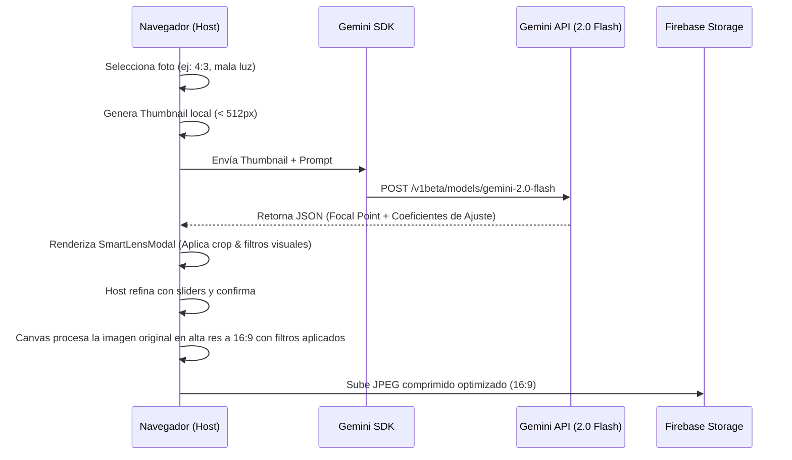

# Especificación de Diseño: Optimizador de Fotos con IA (VeneStay Smart Lens AI)

## 1. Objetivo del Usuario

Como anfitrión (host) de VeneStay, quiero que las fotos de mi propiedad se recorten automáticamente a un formato horizontal estándar (16:9) y se optimicen sus niveles de iluminación y contraste mediante inteligencia artificial, de forma rápida y sencilla antes de subirlas a la galería, para garantizar que mi anuncio luzca premium y profesional con el menor esfuerzo.

---

## 2. Alcance y Límites

- **Incluye:**
  - **Paso de IA de bajo costo:** Uso de `gemini-2.0-flash` enviando un thumbnail de baja resolución (máx 512px) generado en el cliente, obteniendo un JSON con el punto focal (`focalPoint`) para recorte y ajustes de color recomendados (`adjustments`).
  - **Recorte Inteligente 16:9:** Procesamiento en el cliente mediante HTML5 Canvas, centrando el encuadre 16:9 en el punto focal indicado por la IA.
  - **Corrección de Imagen Client-Side:** Ajustes de Brillo, Contraste, Saturación y Exposición en el cliente utilizando filtros CSS/Canvas para corregir mala iluminación, malos ángulos o composición apagada.
  - **Interfaz de Previsualización ("VeneStay Smart Lens AI"):** Modal interactivo (`SmartLensModal.tsx`) que permite al usuario ver la mejora de la IA en tiempo real y refinar manualmente el recorte y los filtros mediante sliders.
  - **Compresión antes de subir:** Subida a Firebase Storage únicamente de la imagen final procesada a 16:9 y optimizada (JPEG/WebP ~300KB), reduciendo el costo de almacenamiento y ancho de banda.
  
- **No incluye:**
  - Procesamiento pesado de imágenes en backend/servidores (Cloud Functions).
  - Herramientas de retoque complejas (pinceles de clonación, eliminación de objetos, filtros artísticos no fotográficos).

---

## 3. Arquitectura y Flujo Técnico



### Tipos TypeScript Requeridos

```typescript
export interface PhotoAnalysisResult {
  focalPoint: {
    x: number; // 0.0 - 1.0 (coordenada horizontal de enfoque recomendada)
    y: number; // 0.0 - 1.0 (coordenada vertical de enfoque recomendada)
  };
  adjustments: {
    brightness: number;  // Ajuste de brillo (-50 a 50)
    contrast: number;    // Ajuste de contraste (-50 a 50)
    saturation: number;  // Ajuste de saturación (-50 a 50)
    exposure: number;    // Ajuste de exposición (-50 a 50)
  };
  qualityScore: number;  // Escala de 1 a 10
  feedback: {
    issues: string[];    // Ej: ["Baja iluminación", "Perspectiva inclinada"]
    suggestions: string; // Ej: "Incrementa el brillo un 15% y centra el encuadre en el juego de cama"
  };
}
```

---

## 4. UI / Maquetado Propuesto

- **Modal SmartLensModal (Glassmorphism):**
  - **Área de Visualización:** Canvas de previsualización con relación de aspecto fija de 16:9, con bordes redondeados y sombra sutil.
  - **Feedback Card:** Panel lateral derecho con el "Score de Calidad" (esfera dorada con gradiente) y la retroalimentación de la IA (mensajes accesibles con iconos como `Sun` o `Sparkles`).
  - **Sliders de Ajuste:** Controles estilizados para:
    - *Desplazamiento de encuadre (Crop Offset)*
    - *Brillo (Brightness)*
    - *Contraste (Contrast)*
    - *Saturación (Saturation)*
  - **Botones de Acción:**
    - "Aplicar Optimización IA" (Acento dorado `--color-gold`, con micro-animaciones).
    - "Cancelar" (Estilo minimalista text-gray).

---

## 5. Criterios de Aceptación (Verificaciones de QA)

- [ ] **CA-1:** La subida de imágenes de más de 4MB se intercepta antes de cargarse al servidor y se procesa localmente.
- [ ] **CA-2:** Se genera un thumbnail de menos de 100KB para el payload de la API de Gemini.
- [ ] **CA-3:** La llamada a Gemini API utiliza el modelo `gemini-2.0-flash` o superior y fuerza el modo de respuesta estructurada JSON.
- [ ] **CA-4:** Si la API falla por red o cuotas, la aplicación ejecuta un fallback a recorte central 16:9 sin filtros de manera transparente para el usuario.
- [ ] **CA-5:** La imagen final subida a Firebase Storage tiene una relación de aspecto estricta de 16:9.
- [ ] **CA-6:** Accesibilidad: Todos los controles deslizantes (sliders) del modal tienen etiquetas semánticas y soporte para teclado (`ArrowLeft` / `ArrowRight`).
